Basic Example
================
Ruben Cabrera
2023-08-01

## Basic Example

Basic Example

<https://www.youtube.com/watch?v=oI1_SV1Rpfc>

``` r
library(nlme)
library(lmerTest)
library(ggplot2)
library(dplyr) # For filter
library(lattice)
# install.packages("sjPlot")
library(sjPlot) # To use plot_model
```

## Data

``` r
df <- data.frame(
  Weight=c(102,96,83,79,97,93,79,77,95,87,78,75,93,85,74,72),
  Subjects=c(1,2,3,4,1,2,3,4,1,2,3,4,1,2,3,4),
  Diet=c('A','A','B','B','A','A','B','B','A','A','B','B','A','A','B','B'),
  Weeks=c(0,0,0,0,1,1,1,1,2,2,2,2,3,3,3,3)
)
```

## Plot data

``` r
ggplot(df, aes(x = Weeks, y = Weight, group = factor(Subjects), color = factor(Subjects))) + geom_line()+ geom_point() + xlab('Weeks')
```

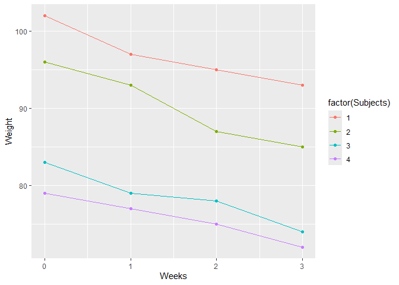<!-- -->

## Model 1: Weight ~ Weeks+(1\|Subjects)

``` r
M1 <- lmer(Weight ~ Weeks+(1|Subjects),REML = F, data = df)
summary(M1)
```

    ## Linear mixed model fit by maximum likelihood . t-tests use Satterthwaite's
    ##   method [lmerModLmerTest]
    ## Formula: Weight ~ Weeks + (1 | Subjects)
    ##    Data: df
    ## 
    ##      AIC      BIC   logLik deviance df.resid 
    ##     78.2     81.3    -35.1     70.2       12 
    ## 
    ## Scaled residuals: 
    ##      Min       1Q   Median       3Q      Max 
    ## -1.59974 -0.76145 -0.02532  0.71385  1.20036 
    ## 
    ## Random effects:
    ##  Groups   Name        Variance Std.Dev.
    ##  Subjects (Intercept) 72.965   8.542   
    ##  Residual              1.186   1.089   
    ## Number of obs: 16, groups:  Subjects, 4
    ## 
    ## Fixed effects:
    ##             Estimate Std. Error      df t value Pr(>|t|)    
    ## (Intercept)  89.7750     4.2952  4.0584   20.90 2.76e-05 ***
    ## Weeks        -2.9750     0.2436 12.0000  -12.21 3.97e-08 ***
    ## ---
    ## Signif. codes:  0 '***' 0.001 '**' 0.01 '*' 0.05 '.' 0.1 ' ' 1
    ## 
    ## Correlation of Fixed Effects:
    ##       (Intr)
    ## Weeks -0.085

``` r
random.effects(M1)  # ranefe(M1)  random.effects(M1)
```

    ## $Subjects
    ##   (Intercept)
    ## 1   11.391193
    ## 2    4.917510
    ## 3   -6.784918
    ## 4   -9.523784
    ## 
    ## with conditional variances for "Subjects"

# Plots Model M1: Weight ~ Weeks+(1\|Subjects)

``` r
# Residuals vs Fitted
plot(M1, which = 1)
```

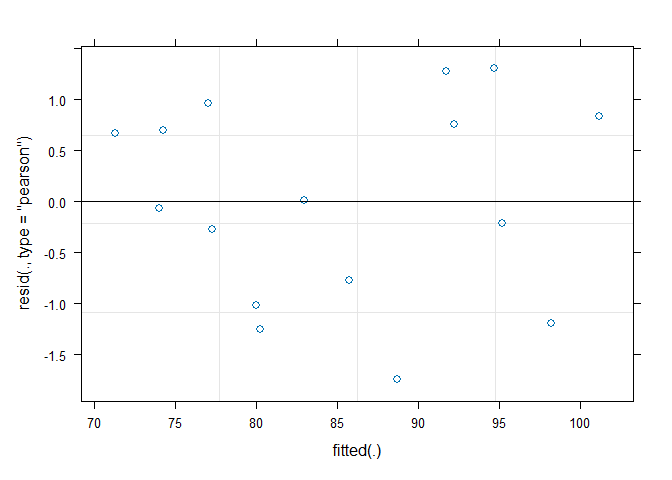<!-- -->

``` r
# Dotplot of random effects
dotplot(ranef(M1, condVar = TRUE))
```

    ## $Subjects

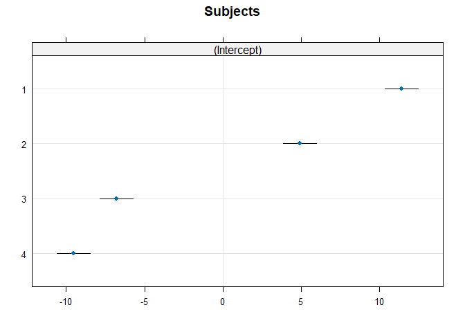<!-- -->

``` r
# Install and load the sjPlot package

# Plot fixed and random effects
sjPlot::plot_model(M1, type = "re")
```

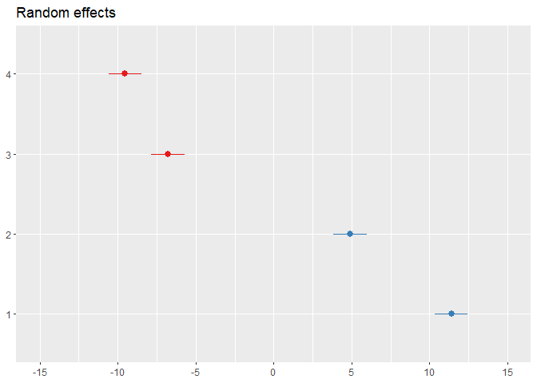<!-- -->

``` r
# Plot general fit

ggplot(df, aes(x = Weeks, y = Weight, color = factor(Subjects))) +
  geom_point() +
  geom_line(aes(group = Subjects), linetype = "dashed") +
  geom_smooth(method = "lm", se = FALSE, color = "black")
```

    ## `geom_smooth()` using formula = 'y ~ x'

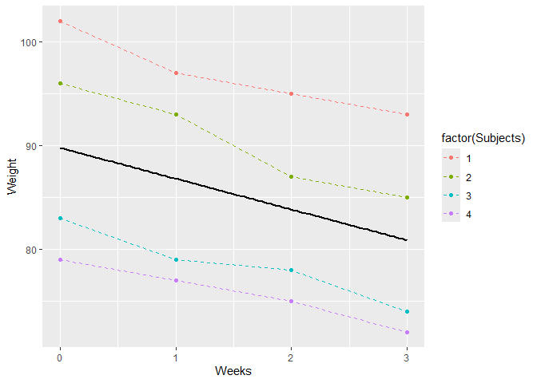<!-- -->

``` r
# Extract fitted values
df$fitted <- fitted(M1)

# Plot fitted

ggplot(df, aes(x = Weeks, y = Weight, color = Subjects)) +
  geom_point() +
  geom_line(aes(y = fitted, group = Subjects)) +
  labs(title = "Fitted Values for Each Subject", x = "Weeks", y = "Weight")
```

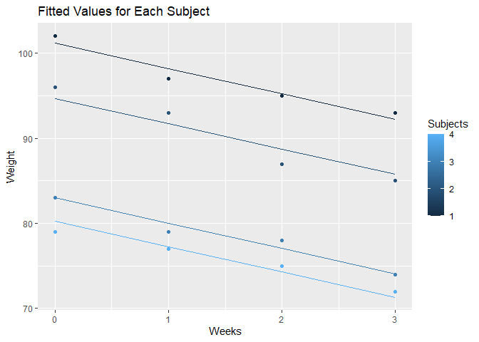<!-- --> \#
Model 2: Weight ~ Weeks+(1+Weeks\|Subjects)

``` r
M2 <- lmer(Weight ~ Weeks+(1+Weeks|Subjects),REML = F, data = df)
summary(M2)
```

    ## Linear mixed model fit by maximum likelihood . t-tests use Satterthwaite's
    ##   method [lmerModLmerTest]
    ## Formula: Weight ~ Weeks + (1 + Weeks | Subjects)
    ##    Data: df
    ## 
    ##      AIC      BIC   logLik deviance df.resid 
    ##     80.1     84.8    -34.1     68.1       10 
    ## 
    ## Scaled residuals: 
    ##      Min       1Q   Median       3Q      Max 
    ## -1.66979 -0.49133  0.01576  0.59856  1.34245 
    ## 
    ## Random effects:
    ##  Groups   Name        Variance Std.Dev. Corr 
    ##  Subjects (Intercept) 81.8810  9.0488        
    ##           Weeks        0.1494  0.3865   -0.88
    ##  Residual              0.9375  0.9682        
    ## Number of obs: 16, groups:  Subjects, 4
    ## 
    ## Fixed effects:
    ##             Estimate Std. Error      df t value Pr(>|t|)    
    ## (Intercept)  89.7750     4.5425  4.0000   19.76 3.87e-05 ***
    ## Weeks        -2.9750     0.2902  4.0000  -10.25  0.00051 ***
    ## ---
    ## Signif. codes:  0 '***' 0.001 '**' 0.01 '*' 0.05 '.' 0.1 ' ' 1
    ## 
    ## Correlation of Fixed Effects:
    ##       (Intr)
    ## Weeks -0.634

``` r
random.effects(M2)  # ranefe(M2)
```

    ## $Subjects
    ##   (Intercept)      Weeks
    ## 1   11.910145 -0.3533220
    ## 2    5.429013 -0.3186238
    ## 3   -7.159983  0.2485599
    ## 4  -10.179176  0.4233859
    ## 
    ## with conditional variances for "Subjects"

# Plots Model M2: Weight ~ Weeks+(1+Weeks\|Subjects)

``` r
# Residuals vs Fitted
plot(M2, which = 1)
```

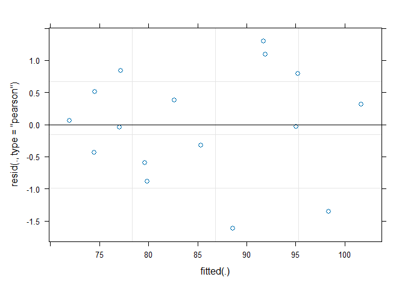<!-- -->

``` r
# Extract fitted values
df$fitted <- fitted(M2)

# Plot fitted

ggplot(df, aes(x = Weeks, y = Weight, color = Subjects)) +
  geom_point() +
  geom_line(aes(y = fitted, group = Subjects)) +
  labs(title = "Fitted Values for Each Subject", x = "Weeks", y = "Weight")
```

<!-- -->

``` r
plot_model(M2,type ="pred", terms = c("Weeks"))
```

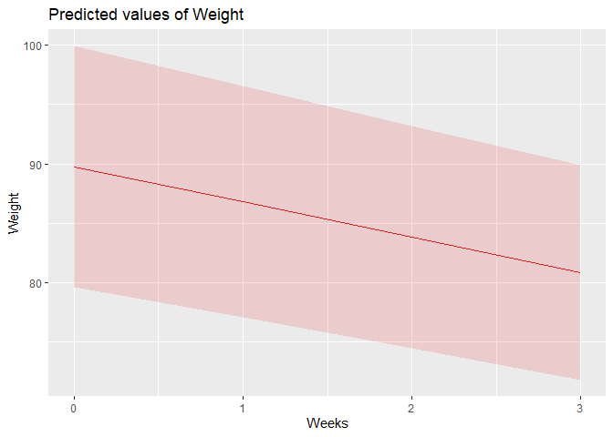<!-- -->

# Model 3: Weight ~ Weeks+(0+Weeks\|Subjects)

``` r
M3 <- lmer(Weight ~ Weeks+(0+Weeks|Subjects),REML = F, data = df)
summary(M3)
```

    ## Linear mixed model fit by maximum likelihood . t-tests use Satterthwaite's
    ##   method [lmerModLmerTest]
    ## Formula: Weight ~ Weeks + (0 + Weeks | Subjects)
    ##    Data: df
    ## 
    ##      AIC      BIC   logLik deviance df.resid 
    ##    118.4    121.4    -55.2    110.4       12 
    ## 
    ## Scaled residuals: 
    ##      Min       1Q   Median       3Q      Max 
    ## -1.70521 -0.55968  0.00879  0.61121  1.93468 
    ## 
    ## Random effects:
    ##  Groups   Name  Variance Std.Dev.
    ##  Subjects Weeks  9.778   3.127   
    ##  Residual       39.928   6.319   
    ## Number of obs: 16, groups:  Subjects, 4
    ## 
    ## Fixed effects:
    ##             Estimate Std. Error     df t value Pr(>|t|)    
    ## (Intercept)   89.775      2.643 12.000  33.962  2.7e-13 ***
    ## Weeks         -2.975      2.107  7.500  -1.412    0.198    
    ## ---
    ## Signif. codes:  0 '***' 0.001 '**' 0.01 '*' 0.05 '.' 0.1 ' ' 1
    ## 
    ## Correlation of Fixed Effects:
    ##       (Intr)
    ## Weeks -0.538

``` r
random.effects(M3)  # ranefe(M3)
```

    ## $Subjects
    ##       Weeks
    ## 1  3.815645
    ## 2  1.382480
    ## 3 -2.211968
    ## 4 -2.986157
    ## 
    ## with conditional variances for "Subjects"

# Plots Model M3: Weight ~ Weeks+(0+Weeks\|Subjects)

``` r
# Residuals vs Fitted
plot(M3, which = 1)
```

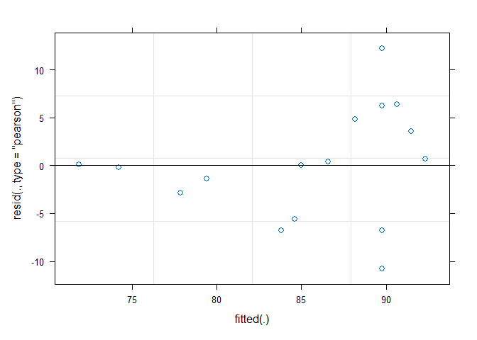<!-- -->

``` r
# Extract fitted values
df$fitted <- fitted(M3)

# Plot fitted

ggplot(df, aes(x = Weeks, y = Weight, color = Subjects)) +
  geom_point() +
  geom_line(aes(y = fitted, group = Subjects)) +
  labs(title = "Fitted Values for Each Subject", x = "Weeks", y = "Weight")
```

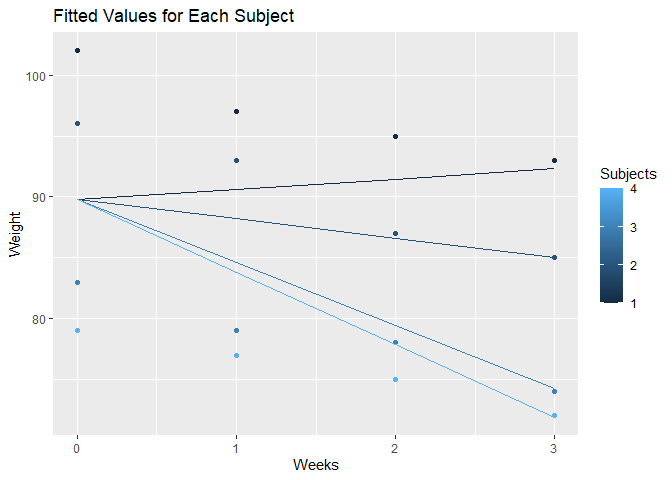<!-- -->

``` r
plot_model(M3,type ="pred", terms = c("Weeks"))
```

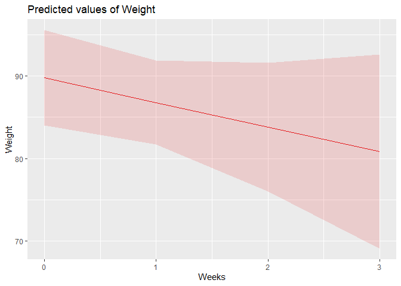<!-- -->

# Model 4: Weight ~ Weeks+Diet+(1\|Subjects)

``` r
M4 <- lmer(Weight ~ Weeks+Diet+(1|Subjects),REML = F, data = df)
summary(M4)
```

    ## Linear mixed model fit by maximum likelihood . t-tests use Satterthwaite's
    ##   method [lmerModLmerTest]
    ## Formula: Weight ~ Weeks + Diet + (1 | Subjects)
    ##    Data: df
    ## 
    ##      AIC      BIC   logLik deviance df.resid 
    ##     70.3     74.2    -30.2     60.3       11 
    ## 
    ## Scaled residuals: 
    ##      Min       1Q   Median       3Q      Max 
    ## -1.76023 -0.85112  0.06013  0.81347  1.03987 
    ## 
    ## Random effects:
    ##  Groups   Name        Variance Std.Dev.
    ##  Subjects (Intercept) 5.930    2.435   
    ##  Residual             1.186    1.089   
    ## Number of obs: 16, groups:  Subjects, 4
    ## 
    ## Fixed effects:
    ##             Estimate Std. Error       df t value Pr(>|t|)    
    ## (Intercept)  97.9625     1.8019   4.3477  54.367 2.51e-07 ***
    ## Weeks        -2.9750     0.2436  12.0000 -12.215 3.97e-08 ***
    ## DietB       -16.3750     2.4953   4.0000  -6.562  0.00279 ** 
    ## ---
    ## Signif. codes:  0 '***' 0.001 '**' 0.01 '*' 0.05 '.' 0.1 ' ' 1
    ## 
    ## Correlation of Fixed Effects:
    ##       (Intr) Weeks 
    ## Weeks -0.203       
    ## DietB -0.692  0.000

``` r
random.effects(M4)  # ranefe(M3)
```

    ## $Subjects
    ##   (Intercept)
    ## 1    3.095180
    ## 2   -3.095180
    ## 3    1.309499
    ## 4   -1.309499
    ## 
    ## with conditional variances for "Subjects"

``` r
coef(M4)
```

    ## $Subjects
    ##   (Intercept)  Weeks   DietB
    ## 1   101.05768 -2.975 -16.375
    ## 2    94.86732 -2.975 -16.375
    ## 3    99.27200 -2.975 -16.375
    ## 4    96.65300 -2.975 -16.375
    ## 
    ## attr(,"class")
    ## [1] "coef.mer"

``` r
fixef(M4)
```

    ## (Intercept)       Weeks       DietB 
    ##     97.9625     -2.9750    -16.3750

# Plots Model M4: Weight ~ Weeks+Diet+(1\|Subjects)

``` r
# Residuals vs Fitted
plot(M4, which = 1)
```

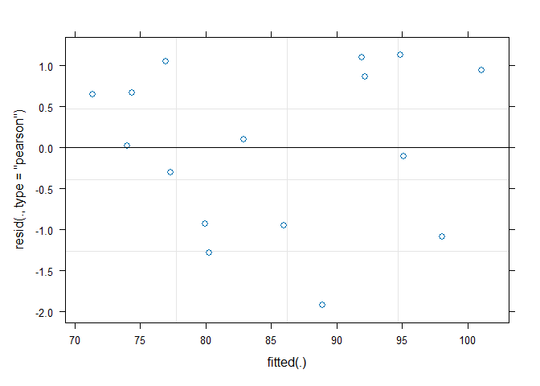<!-- -->

``` r
# Extract fitted values
df$fitted <- fitted(M4)

# Plot fitted by Subjects
p <- ggplot()
p <- p + geom_point(data=df, aes(x = Weeks, y = Weight, color = Subjects))
p
```

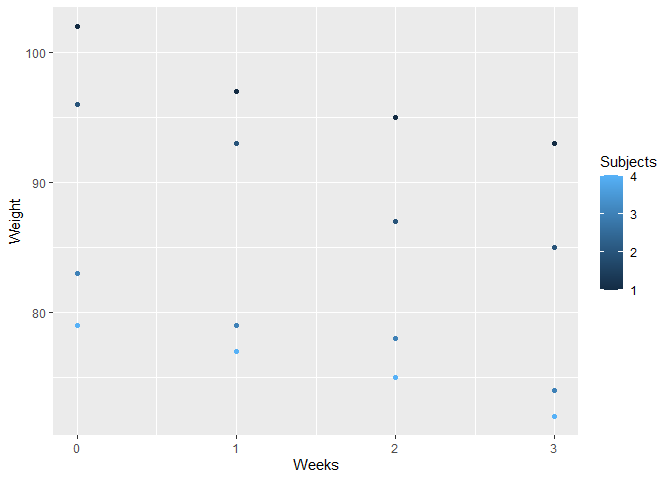<!-- -->

``` r
plot_fit_by_subjects <- geom_line(data = df, aes(x = Weeks, y = fitted, group = Subjects)) 
q <- p + plot_fit_by_subjects
q + labs(title = "Fitted Values for Each Subject", x = "Weeks", y = "Weight")
```

<!-- -->

``` r
# Plot fitted by Diet
df$fit_by_Diet <- ifelse(df$Diet=='A',fixef(M4)["(Intercept)"] + df$Weeks*fixef(M4)["Weeks"],
                         (fixef(M4)["(Intercept)"]+fixef(M4)["DietB"]) + df$Weeks*fixef(M4)["Weeks"]
                        )

plot_fit_by_diets <- geom_line(data = df, aes(x = Weeks, y = fit_by_Diet, group = Diet)) 
r <- p + plot_fit_by_diets
r + labs(title = "Fitted Values for Each Diet", x = "Weeks", y = "Weight")
```

<!-- -->

``` r
plot_model(M4,type ="pred", terms = c("Weeks","Diet"))
```

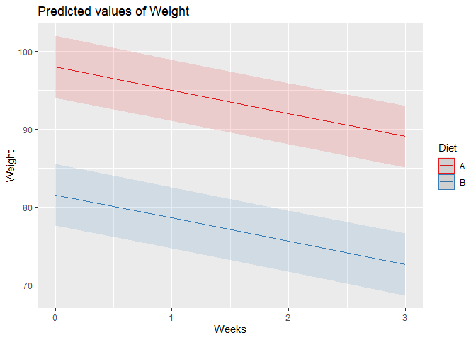<!-- --> \#
Model 5: Weight ~ Weeks\*Diet+(1\|Subjects)

``` r
M5 <- lmer(Weight ~ Weeks*Diet+(1|Subjects),REML = F, data = df)
summary(M5)
```

    ## Linear mixed model fit by maximum likelihood . t-tests use Satterthwaite's
    ##   method [lmerModLmerTest]
    ## Formula: Weight ~ Weeks * Diet + (1 | Subjects)
    ##    Data: df
    ## 
    ##      AIC      BIC   logLik deviance df.resid 
    ##     68.8     73.4    -28.4     56.8       10 
    ## 
    ## Scaled residuals: 
    ##     Min      1Q  Median      3Q     Max 
    ## -1.7700 -0.6636  0.0487  0.6183  1.5575 
    ## 
    ## Random effects:
    ##  Groups   Name        Variance Std.Dev.
    ##  Subjects (Intercept) 6.0052   2.451   
    ##  Residual             0.8854   0.941   
    ## Number of obs: 16, groups:  Subjects, 4
    ## 
    ## Fixed effects:
    ##             Estimate Std. Error       df t value Pr(>|t|)    
    ## (Intercept)  98.6000     1.8200   4.5221  54.175 1.55e-07 ***
    ## Weeks        -3.4000     0.2976  12.0000 -11.426 8.33e-08 ***
    ## DietB       -17.6500     2.5739   4.5221  -6.857  0.00149 ** 
    ## Weeks:DietB   0.8500     0.4208  12.0000   2.020  0.06630 .  
    ## ---
    ## Signif. codes:  0 '***' 0.001 '**' 0.01 '*' 0.05 '.' 0.1 ' ' 1
    ## 
    ## Correlation of Fixed Effects:
    ##             (Intr) Weeks  DietB 
    ## Weeks       -0.245              
    ## DietB       -0.707  0.173       
    ## Weeks:DietB  0.173 -0.707 -0.245

``` r
random.effects(M5)  # ranefe(M5)
```

    ## $Subjects
    ##   (Intercept)
    ## 1    3.134463
    ## 2   -3.134463
    ## 3    1.326119
    ## 4   -1.326119
    ## 
    ## with conditional variances for "Subjects"

``` r
coef(M5)
```

    ## $Subjects
    ##   (Intercept) Weeks  DietB Weeks:DietB
    ## 1   101.73446  -3.4 -17.65        0.85
    ## 2    95.46554  -3.4 -17.65        0.85
    ## 3    99.92612  -3.4 -17.65        0.85
    ## 4    97.27388  -3.4 -17.65        0.85
    ## 
    ## attr(,"class")
    ## [1] "coef.mer"

``` r
fixef(M5)
```

    ## (Intercept)       Weeks       DietB Weeks:DietB 
    ##       98.60       -3.40      -17.65        0.85

# Plots Model M5: Weight ~ Weeks\*Diet+(1\|Subjects)

``` r
# Residuals vs Fitted
plot(M5, which = 1)
```

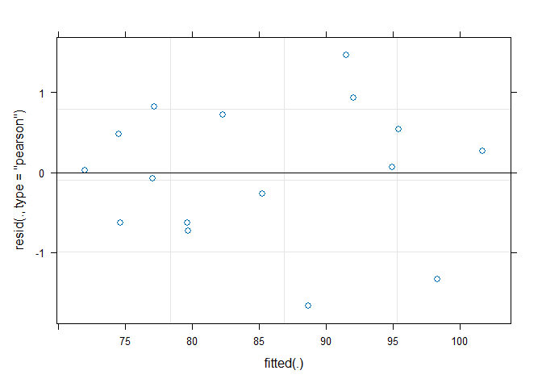<!-- -->

``` r
# Extract fitted values
df$fitted <- fitted(M5)

# Plot fitted by Subjects
p <- ggplot()
p <- p + geom_point(data=df, aes(x = Weeks, y = Weight, color = Subjects))
p
```

<!-- -->

``` r
plot_fit_by_subjects <- geom_line(data = df, aes(x = Weeks, y = fitted, group = Subjects)) 
q <- p + plot_fit_by_subjects
q + labs(title = "Fitted Values for Each Subject", x = "Weeks", y = "Weight")
```

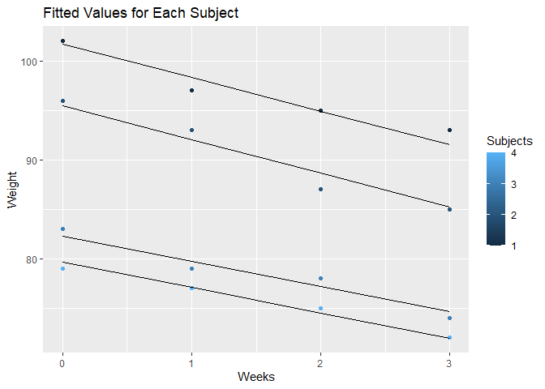<!-- -->

``` r
# Plot fitted by Diet
df$fit_by_Diet <- ifelse(df$Diet=='A',fixef(M5)["(Intercept)"] + df$Weeks*fixef(M5)["Weeks"],
                         (fixef(M5)["(Intercept)"]+fixef(M5)["DietB"]) +
                           df$Weeks*(fixef(M5)["Weeks"]+fixef(M5)["Weeks:DietB"])
                        )

plot_fit_by_diets <- geom_line(data = df, aes(x = Weeks, y = fit_by_Diet, group = Diet)) 
r <- p + plot_fit_by_diets
r + labs(title = "Fitted Values for Each Diet", x = "Weeks", y = "Weight")
```

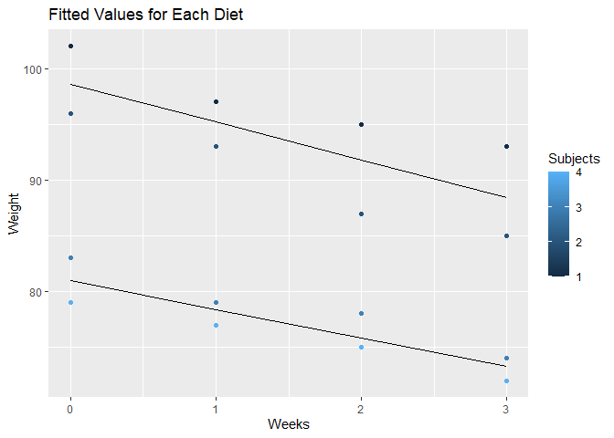<!-- -->

``` r
plot_model(M5,type ="pred", terms = c("Weeks","Diet"))
```

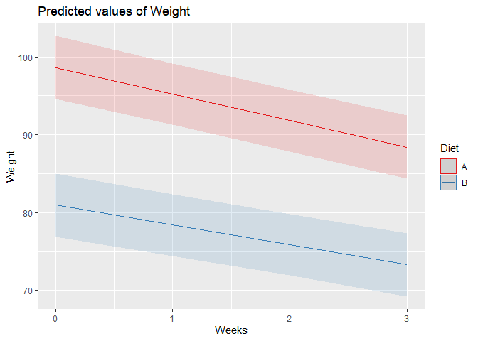<!-- --> \#
Model 6: Weeks+Diet+(1\|Subjects)

``` r
M6 <- lmer(Weight ~ Weeks+Diet+(1|Subjects),REML = F, data = df)
summary(M6)
```

    ## Linear mixed model fit by maximum likelihood . t-tests use Satterthwaite's
    ##   method [lmerModLmerTest]
    ## Formula: Weight ~ Weeks + Diet + (1 | Subjects)
    ##    Data: df
    ## 
    ##      AIC      BIC   logLik deviance df.resid 
    ##     70.3     74.2    -30.2     60.3       11 
    ## 
    ## Scaled residuals: 
    ##      Min       1Q   Median       3Q      Max 
    ## -1.76023 -0.85112  0.06013  0.81347  1.03987 
    ## 
    ## Random effects:
    ##  Groups   Name        Variance Std.Dev.
    ##  Subjects (Intercept) 5.930    2.435   
    ##  Residual             1.186    1.089   
    ## Number of obs: 16, groups:  Subjects, 4
    ## 
    ## Fixed effects:
    ##             Estimate Std. Error       df t value Pr(>|t|)    
    ## (Intercept)  97.9625     1.8019   4.3477  54.367 2.51e-07 ***
    ## Weeks        -2.9750     0.2436  12.0000 -12.215 3.97e-08 ***
    ## DietB       -16.3750     2.4953   4.0000  -6.562  0.00279 ** 
    ## ---
    ## Signif. codes:  0 '***' 0.001 '**' 0.01 '*' 0.05 '.' 0.1 ' ' 1
    ## 
    ## Correlation of Fixed Effects:
    ##       (Intr) Weeks 
    ## Weeks -0.203       
    ## DietB -0.692  0.000

``` r
random.effects(M6)  # ranefe(M6)
```

    ## $Subjects
    ##   (Intercept)
    ## 1    3.095180
    ## 2   -3.095180
    ## 3    1.309499
    ## 4   -1.309499
    ## 
    ## with conditional variances for "Subjects"

``` r
coef(M6)
```

    ## $Subjects
    ##   (Intercept)  Weeks   DietB
    ## 1   101.05768 -2.975 -16.375
    ## 2    94.86732 -2.975 -16.375
    ## 3    99.27200 -2.975 -16.375
    ## 4    96.65300 -2.975 -16.375
    ## 
    ## attr(,"class")
    ## [1] "coef.mer"

``` r
fixef(M6)
```

    ## (Intercept)       Weeks       DietB 
    ##     97.9625     -2.9750    -16.3750

# Plots Model M6: Weeks+Diet+(1\|Subjects)

``` r
# Residuals vs Fitted
plot(M6, which = 1)
```

<!-- -->

``` r
# Extract fitted values
df$fitted <- fitted(M6)

# Plot fitted by Subjects
p <- ggplot()
p <- p + geom_point(data=df, aes(x = Weeks, y = Weight, color = Subjects))
p
```

<!-- -->

``` r
plot_fit_by_subjects <- geom_line(data = df, aes(x = Weeks, y = fitted, group = Subjects)) 
q <- p + plot_fit_by_subjects
q + labs(title = "Fitted Values for Each Subject", x = "Weeks", y = "Weight")
```

<!-- -->

``` r
# Plot fitted by Diet
df$fit_by_Diet <- ifelse(df$Diet=='A',fixef(M6)["(Intercept)"] + df$Weeks*fixef(M6)["Weeks"],
                         (fixef(M6)["(Intercept)"]+fixef(M6)["DietB"]) +
                           df$Weeks*fixef(M6)["Weeks"]
                        )

plot_fit_by_diets <- geom_line(data = df, aes(x = Weeks, y = fit_by_Diet, group = Diet)) 
r <- p + plot_fit_by_diets
r + labs(title = "Fitted Values for Each Diet", x = "Weeks", y = "Weight")
```

<!-- -->

``` r
# Plot fitted by Diet
plot_model(M6,type ="pred", terms = c("Weeks","Diet"))
```

<!-- -->

# Model 7: Weeks\*Diet+(1\|Subjects)

``` r
M7 <- lmer(Weight ~ Weeks*Diet+(1|Subjects),REML = F, data = df)
summary(M7)
```

    ## Linear mixed model fit by maximum likelihood . t-tests use Satterthwaite's
    ##   method [lmerModLmerTest]
    ## Formula: Weight ~ Weeks * Diet + (1 | Subjects)
    ##    Data: df
    ## 
    ##      AIC      BIC   logLik deviance df.resid 
    ##     68.8     73.4    -28.4     56.8       10 
    ## 
    ## Scaled residuals: 
    ##     Min      1Q  Median      3Q     Max 
    ## -1.7700 -0.6636  0.0487  0.6183  1.5575 
    ## 
    ## Random effects:
    ##  Groups   Name        Variance Std.Dev.
    ##  Subjects (Intercept) 6.0052   2.451   
    ##  Residual             0.8854   0.941   
    ## Number of obs: 16, groups:  Subjects, 4
    ## 
    ## Fixed effects:
    ##             Estimate Std. Error       df t value Pr(>|t|)    
    ## (Intercept)  98.6000     1.8200   4.5221  54.175 1.55e-07 ***
    ## Weeks        -3.4000     0.2976  12.0000 -11.426 8.33e-08 ***
    ## DietB       -17.6500     2.5739   4.5221  -6.857  0.00149 ** 
    ## Weeks:DietB   0.8500     0.4208  12.0000   2.020  0.06630 .  
    ## ---
    ## Signif. codes:  0 '***' 0.001 '**' 0.01 '*' 0.05 '.' 0.1 ' ' 1
    ## 
    ## Correlation of Fixed Effects:
    ##             (Intr) Weeks  DietB 
    ## Weeks       -0.245              
    ## DietB       -0.707  0.173       
    ## Weeks:DietB  0.173 -0.707 -0.245

``` r
random.effects(M7)  # ranefe(M7)
```

    ## $Subjects
    ##   (Intercept)
    ## 1    3.134463
    ## 2   -3.134463
    ## 3    1.326119
    ## 4   -1.326119
    ## 
    ## with conditional variances for "Subjects"

``` r
coef(M7)
```

    ## $Subjects
    ##   (Intercept) Weeks  DietB Weeks:DietB
    ## 1   101.73446  -3.4 -17.65        0.85
    ## 2    95.46554  -3.4 -17.65        0.85
    ## 3    99.92612  -3.4 -17.65        0.85
    ## 4    97.27388  -3.4 -17.65        0.85
    ## 
    ## attr(,"class")
    ## [1] "coef.mer"

``` r
fixef(M7)
```

    ## (Intercept)       Weeks       DietB Weeks:DietB 
    ##       98.60       -3.40      -17.65        0.85

# Plots Model M7: Weeks\*Diet+(1\|Subjects)

``` r
# Residuals vs Fitted
plot(M7, which = 1)
```

<!-- -->

``` r
# Extract fitted values
df$fitted <- fitted(M7)

# Plot fitted by Subjects
p <- ggplot()
p <- p + geom_point(data=df, aes(x = Weeks, y = Weight, color = Subjects))
p
```

<!-- -->

``` r
plot_fit_by_subjects <- geom_line(data = df, aes(x = Weeks, y = fitted, group = Subjects)) 
q <- p + plot_fit_by_subjects
q + labs(title = "Fitted Values for Each Subject", x = "Weeks", y = "Weight")
```

<!-- -->

``` r
# Plot fitted by Diet
df$fit_by_Diet <- ifelse(df$Diet=='A',fixef(M7)["(Intercept)"] + df$Weeks*fixef(M7)["Weeks"],
                         (fixef(M7)["(Intercept)"]+fixef(M7)["DietB"]) +
                           df$Weeks*(fixef(M7)["Weeks"]+fixef(M7)["Weeks:DietB"])
                        )

plot_fit_by_diets <- geom_line(data = df, aes(x = Weeks, y = fit_by_Diet, group = Diet)) 
r <- p + plot_fit_by_diets
r + labs(title = "Fitted Values for Each Diet", x = "Weeks", y = "Weight")
```

<!-- -->

``` r
# Plot fitted by Diet
plot_model(M7,type ="pred", terms = c("Weeks","Diet"))
```

<!-- --> \#
Anova M6 vs M7:

``` r
anova(M6,M7)
```

    ## Data: df
    ## Models:
    ## M6: Weight ~ Weeks + Diet + (1 | Subjects)
    ## M7: Weight ~ Weeks * Diet + (1 | Subjects)
    ##    npar    AIC    BIC  logLik deviance Chisq Df Pr(>Chisq)  
    ## M6    5 70.318 74.181 -30.159   60.318                      
    ## M7    6 68.806 73.442 -28.403   56.806 3.512  1    0.06092 .
    ## ---
    ## Signif. codes:  0 '***' 0.001 '**' 0.01 '*' 0.05 '.' 0.1 ' ' 1

# Model 8: Weeks+Diet+(1+Weeks\|Subjects)

``` r
M8 <- lmer(Weight ~ Weeks+Diet+(1+Weeks|Subjects),REML = F, data = df)
```

    ## boundary (singular) fit: see help('isSingular')

``` r
summary(M8)
```

    ## Linear mixed model fit by maximum likelihood . t-tests use Satterthwaite's
    ##   method [lmerModLmerTest]
    ## Formula: Weight ~ Weeks + Diet + (1 + Weeks | Subjects)
    ##    Data: df
    ## 
    ##      AIC      BIC   logLik deviance df.resid 
    ##     71.8     77.2    -28.9     57.8        9 
    ## 
    ## Scaled residuals: 
    ##     Min      1Q  Median      3Q     Max 
    ## -1.6017 -0.6185  0.1811  0.6980  1.3621 
    ## 
    ## Random effects:
    ##  Groups   Name        Variance Std.Dev. Corr
    ##  Subjects (Intercept) 4.8065   2.1924       
    ##           Weeks       0.1934   0.4397   1.00
    ##  Residual             0.8627   0.9288       
    ## Number of obs: 16, groups:  Subjects, 4
    ## 
    ## Fixed effects:
    ##             Estimate Std. Error       df t value Pr(>|t|)    
    ## (Intercept)  99.4191     1.5380   4.0216  64.642 3.21e-07 ***
    ## Weeks        -2.9750     0.3025   4.4834  -9.836 0.000334 ***
    ## DietB       -19.2882     2.0128   4.7080  -9.583 0.000290 ***
    ## ---
    ## Signif. codes:  0 '***' 0.001 '**' 0.01 '*' 0.05 '.' 0.1 ' ' 1
    ## 
    ## Correlation of Fixed Effects:
    ##       (Intr) Weeks 
    ## Weeks  0.379       
    ## DietB -0.654  0.000
    ## optimizer (nloptwrap) convergence code: 0 (OK)
    ## boundary (singular) fit: see help('isSingular')

``` r
random.effects(M8)  # ranefe(M8)
```

    ## $Subjects
    ##   (Intercept)       Weeks
    ## 1   1.3157421  0.26390159
    ## 2  -3.5552031 -0.71307574
    ## 3   2.0853833  0.41827041
    ## 4   0.1540777  0.03090374
    ## 
    ## with conditional variances for "Subjects"

``` r
coef(M8)
```

    ## $Subjects
    ##   (Intercept)     Weeks     DietB
    ## 1   100.73485 -2.711098 -19.28822
    ## 2    95.86391 -3.688076 -19.28822
    ## 3   101.50449 -2.556730 -19.28822
    ## 4    99.57319 -2.944096 -19.28822
    ## 
    ## attr(,"class")
    ## [1] "coef.mer"

``` r
fixef(M8)
```

    ## (Intercept)       Weeks       DietB 
    ##    99.41911    -2.97500   -19.28822

# Plots Model M8: Weeks+Diet+(1+Weeks\|Subjects)

``` r
# Residuals vs Fitted
plot(M8, which = 1)
```

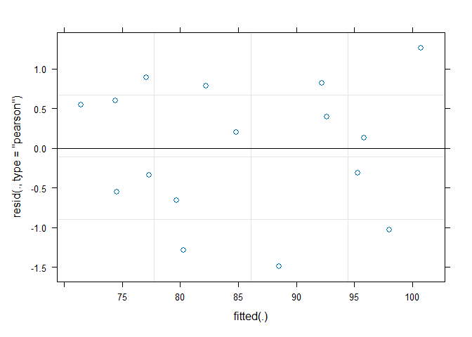<!-- -->

``` r
# Extract fitted values
df$fitted <- fitted(M8)

# Plot fitted by Subjects
p <- ggplot()
p <- p + geom_point(data=df, aes(x = Weeks, y = Weight, color = Subjects))
p
```

<!-- -->

``` r
plot_fit_by_subjects <- geom_line(data = df, aes(x = Weeks, y = fitted, group = Subjects)) 
q <- p + plot_fit_by_subjects
q + labs(title = "Fitted Values for Each Subject", x = "Weeks", y = "Weight")
```

<!-- -->

``` r
# Plot fitted by Diet
plot_model(M8,type ="pred", terms = c("Weeks","Diet"))
```

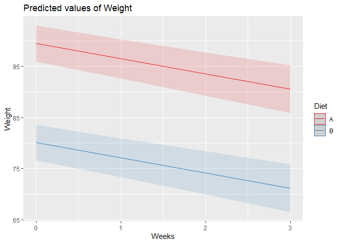<!-- -->

# Model 9: Weeks\*Diet+(1+Weeks\|Subjects)

``` r
M9 <- lmer(Weight ~ Weeks*Diet+(1+Weeks|Subjects),REML = F, data = df)
```

    ## boundary (singular) fit: see help('isSingular')

``` r
summary(M9)
```

    ## Linear mixed model fit by maximum likelihood . t-tests use Satterthwaite's
    ##   method [lmerModLmerTest]
    ## Formula: Weight ~ Weeks * Diet + (1 + Weeks | Subjects)
    ##    Data: df
    ## 
    ##      AIC      BIC   logLik deviance df.resid 
    ##     71.2     77.4    -27.6     55.2        8 
    ## 
    ## Scaled residuals: 
    ##     Min      1Q  Median      3Q     Max 
    ## -1.6640 -0.7487  0.1463  0.8478  1.1008 
    ## 
    ## Random effects:
    ##  Groups   Name        Variance Std.Dev. Corr
    ##  Subjects (Intercept) 4.28682  2.0705       
    ##           Weeks       0.06622  0.2573   1.00
    ##  Residual             0.77356  0.8795       
    ## Number of obs: 16, groups:  Subjects, 4
    ## 
    ## Fixed effects:
    ##             Estimate Std. Error       df t value Pr(>|t|)    
    ## (Intercept)  98.6000     1.5538   4.0272  63.459 3.40e-07 ***
    ## Weeks        -3.4000     0.3324   5.9151 -10.230 5.57e-05 ***
    ## DietB       -17.6500     2.1973   4.0272  -8.032  0.00127 ** 
    ## Weeks:DietB   0.8500     0.4700   5.9151   1.808  0.12126    
    ## ---
    ## Signif. codes:  0 '***' 0.001 '**' 0.01 '*' 0.05 '.' 0.1 ' ' 1
    ## 
    ## Correlation of Fixed Effects:
    ##             (Intr) Weeks  DietB 
    ## Weeks        0.291              
    ## DietB       -0.707 -0.206       
    ## Weeks:DietB -0.206 -0.707  0.291
    ## optimizer (nloptwrap) convergence code: 0 (OK)
    ## boundary (singular) fit: see help('isSingular')

``` r
random.effects(M9)  # ranefe(M9)
```

    ## $Subjects
    ##   (Intercept)      Weeks
    ## 1    2.672181  0.3321304
    ## 2   -2.672181 -0.3321304
    ## 3    1.081826  0.1344622
    ## 4   -1.081826 -0.1344622
    ## 
    ## with conditional variances for "Subjects"

``` r
coef(M9)
```

    ## $Subjects
    ##   (Intercept)     Weeks  DietB Weeks:DietB
    ## 1   101.27218 -3.067870 -17.65        0.85
    ## 2    95.92782 -3.732130 -17.65        0.85
    ## 3    99.68183 -3.265538 -17.65        0.85
    ## 4    97.51817 -3.534462 -17.65        0.85
    ## 
    ## attr(,"class")
    ## [1] "coef.mer"

``` r
fixef(M9)
```

    ## (Intercept)       Weeks       DietB Weeks:DietB 
    ##       98.60       -3.40      -17.65        0.85

# Plots Model M9: Weeks\*Diet+(1+Weeks\|Subjects)

``` r
# Residuals vs Fitted
plot(M9, which = 1)
```

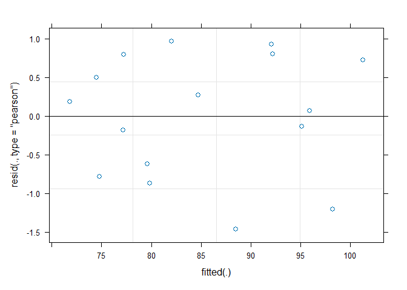<!-- -->

``` r
# Extract fitted values
df$fitted <- fitted(M9)

# Plot fitted by Subjects
p <- ggplot()
p <- p + geom_point(data=df, aes(x = Weeks, y = Weight, color = Subjects))
p
```

<!-- -->

``` r
plot_fit_by_subjects <- geom_line(data = df, aes(x = Weeks, y = fitted, group = Subjects)) 
q <- p + plot_fit_by_subjects
q + labs(title = "Fitted Values for Each Subject", x = "Weeks", y = "Weight")
```

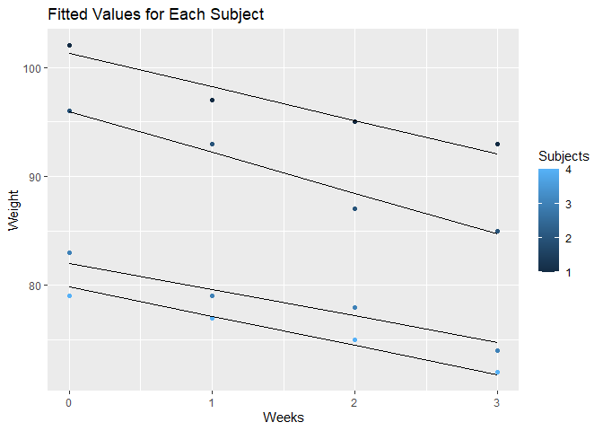<!-- -->

``` r
# Plot fitted by Diet
plot_model(M9,type ="pred", terms = c("Weeks","Diet"))
```

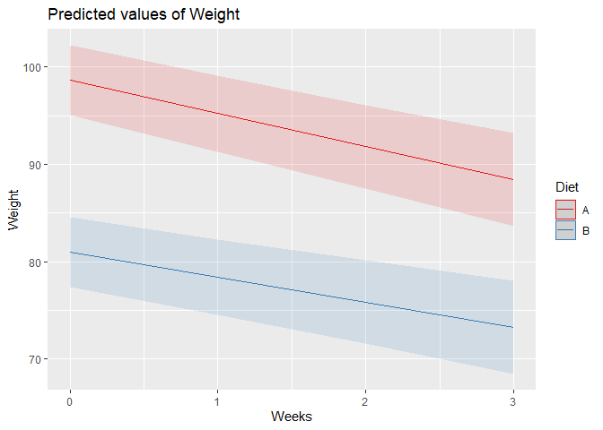<!-- -->
