Basic NonLinear Mixed Effect Example
================
Ruben Cabrera
2023-08-01

## Basic Example

Basic Example

<https://www.youtube.com/watch?v=eGSVcrkd6yU>

``` r
library(nlme)
#library(lmerTest)
library(ggplot2)
library(dplyr) # For filter
library(lattice)
# install.packages("sjPlot")
#library(sjPlot) # To use plot_model
```

## Data

``` r
rm(list = ls())

n=4 # Number of subjects
time=c(10,20,40,60,80,100,120,140)
y1=c(120.8,101.2,64.7,43.2,32.0,19.9,11.9,10.1)
y2=c(140.7,110.8,75.9,49.2,32.5,21.5,17.9,11.8)
y3=c(74.7,61.1,42.2,28.5,15.1,8.1,7.0,5.8)
y4=c(89.1,74.0,46.7,31.2,22.0,14.3,9.4,4.8)
y=c(y1,y2,y3,y4)
Sex=factor(c(rep(c(0,1),c(16,16)))) # 0 = Woman, 1 = Man
t=c(rep(time,4))
Subject=factor(rep(c(1,2,3,4),c(8,8,8,8)))

df = data.frame(y,Subject,Sex,t)
```

## Plot data

``` r
ggplot(df, aes(x = t, y = y, group = Subject, color = Sex)) + geom_line()+ geom_point() + xlab('Weeks')
```

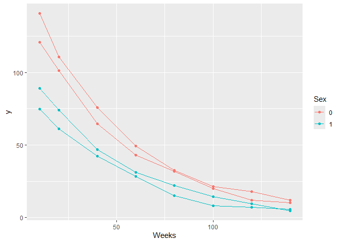<!-- -->

## Models 1-4: y1 to y4

``` r
M1 <- nls(y1 ~ Y0 * exp(-k*time), start = list(Y0=100,k=0.02))
M1
```

    ## Nonlinear regression model
    ##   model: y1 ~ Y0 * exp(-k * time)
    ##    data: parent.frame()
    ##        Y0         k 
    ## 148.53210   0.02012 
    ##  residual sum-of-squares: 17.07
    ## 
    ## Number of iterations to convergence: 3 
    ## Achieved convergence tolerance: 9.492e-07

``` r
M2 <- nls(y2 ~ Y0 * exp(-k*time), start = list(Y0=100,k=0.02))
M2
```

    ## Nonlinear regression model
    ##   model: y2 ~ Y0 * exp(-k * time)
    ##    data: parent.frame()
    ##        Y0         k 
    ## 170.11107   0.02035 
    ##  residual sum-of-squares: 25.56
    ## 
    ## Number of iterations to convergence: 4 
    ## Achieved convergence tolerance: 2.102e-06

``` r
M3 <- nls(y3 ~ Y0 * exp(-k*time), start = list(Y0=100,k=0.02))
M3
```

    ## Nonlinear regression model
    ##   model: y3 ~ Y0 * exp(-k * time)
    ##    data: parent.frame()
    ##       Y0        k 
    ## 93.41423  0.02115 
    ##  residual sum-of-squares: 25.85
    ## 
    ## Number of iterations to convergence: 4 
    ## Achieved convergence tolerance: 2.389e-06

``` r
M4 <- nls(y4 ~ Y0 * exp(-k*time), start = list(Y0=100,k=0.02))
M4
```

    ## Nonlinear regression model
    ##   model: y4 ~ Y0 * exp(-k * time)
    ##    data: parent.frame()
    ##       Y0        k 
    ## 110.2698   0.0208 
    ##  residual sum-of-squares: 6.706
    ## 
    ## Number of iterations to convergence: 3 
    ## Achieved convergence tolerance: 5.173e-08

# Plots Models 1-4: y1 to y4

``` r
# Residuals vs Fitted
plot(M1, which = 1)
```

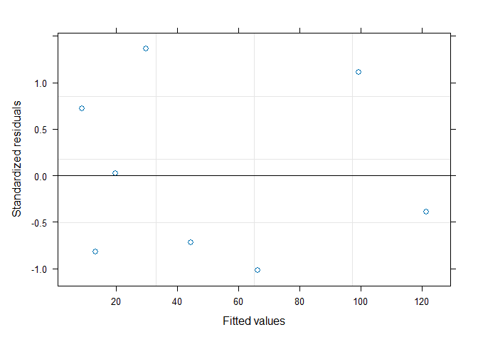<!-- -->

``` r
plot(M2, which = 1)
```

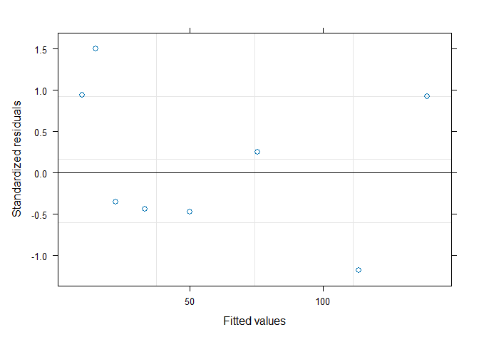<!-- -->

``` r
plot(M3, which = 1)
```

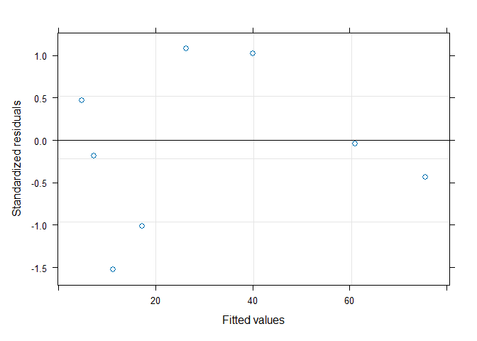<!-- -->

``` r
plot(M4, which = 1)
```

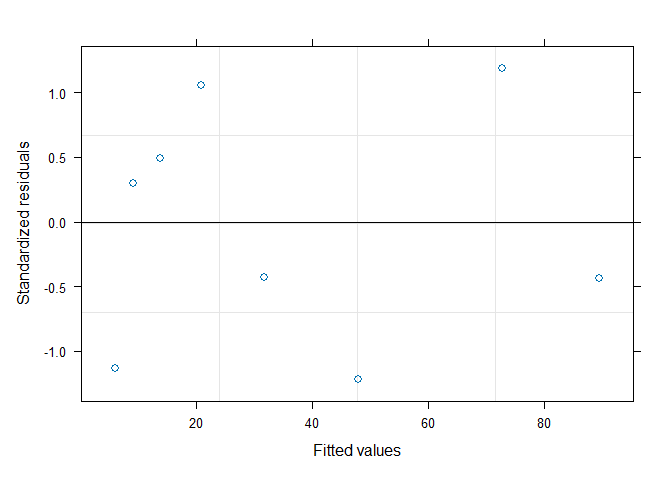<!-- -->

``` r
# Plot general fit

# Extract fitted values
df$fittedM1 <- fitted(M1)
df$fittedM2 <- fitted(M2)
df$fittedM3 <- fitted(M3)
df$fittedM4 <- fitted(M4)

# Plot fitted

ggplot(df, aes(x = t, y = y, color = Subject)) +
  geom_point() +
  geom_line(aes(y = fittedM1, color = "pink")) + 
  geom_line(aes(y = fittedM2, color = "green")) +
  geom_line(aes(y = fittedM3, color = "cyan")) +
  geom_line(aes(y = fittedM4, color = "purple")) +
  labs(title = "Fitted Values for Each Subject", x = "time", y = "y")
```

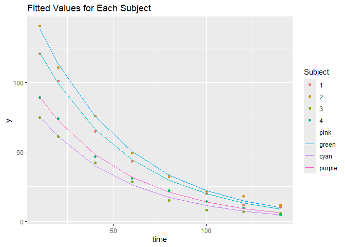<!-- -->
\# Model 5: y ~ y0 \* exp(-k\*t)

``` r
M5 <- nls(y ~ Y0*exp(-k*t), start=c(Y0=100,k=0.02))
summary(M5)
```

    ## 
    ## Formula: y ~ Y0 * exp(-k * t)
    ## 
    ## Parameters:
    ##     Estimate Std. Error t value Pr(>|t|)    
    ## Y0 130.59027    8.74869  14.927 2.00e-15 ***
    ## k    0.02052    0.00213   9.635 1.08e-10 ***
    ## ---
    ## Signif. codes:  0 '***' 0.001 '**' 0.01 '*' 0.05 '.' 0.1 ' ' 1
    ## 
    ## Residual standard error: 13.85 on 30 degrees of freedom
    ## 
    ## Number of iterations to convergence: 3 
    ## Achieved convergence tolerance: 1.378e-07

# Plots Model M5: y ~ y0 \* exp(-k\*t)

``` r
# Residuals vs Fitted
plot(M5, which = 1)
```

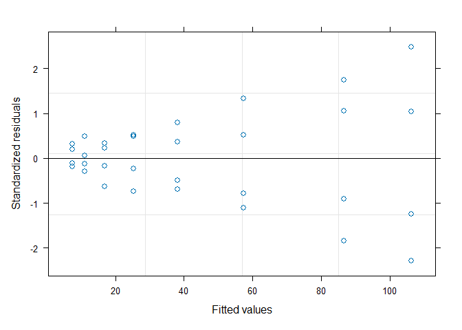<!-- -->

``` r
# Extract fitted values
df$fittedM5 <- fitted(M5)

# Plot fitted

ggplot(df, aes(x = t, y = y, color = Subject)) +
  geom_point() +
  geom_line(aes(y = fittedM5)) +
  labs(title = "Fitted Values for Each Subject", x = "time", y = "y")
```

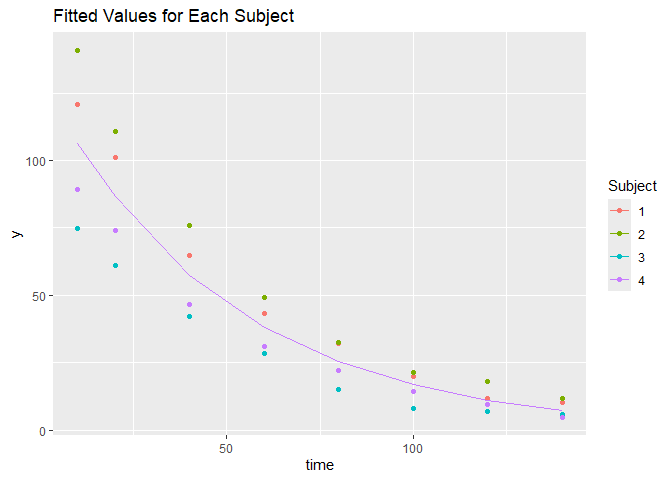<!-- -->

# Model 6: y ~ y0 \* exp(-k \* t)

``` r
gd <- groupedData(y~t|Subject,data=df)
M6 <- nlme(y ~ y0*exp(-k*t), data = gd, 
           random=y0~1,
           fixed=y0+k~1,
           start = c(y0=100,k=0.02))
M6
```

    ## Nonlinear mixed-effects model fit by maximum likelihood
    ##   Model: y ~ y0 * exp(-k * t) 
    ##   Data: gd 
    ##   Log-likelihood: -74.69217
    ##   Fixed: y0 + k ~ 1 
    ##           y0            k 
    ## 130.34489423   0.02044411 
    ## 
    ## Random effects:
    ##  Formula: y0 ~ 1 | Subject
    ##               y0 Residual
    ## StdDev: 31.22201 1.694789
    ## 
    ## Number of Observations: 32
    ## Number of Groups: 4

``` r
random.effects(M6)  # ranefe(M6)
```

    ##          y0
    ## 3 -38.40211
    ## 4 -20.95698
    ## 1  19.29469
    ## 2  40.06440

# Plots Model M6: y ~ y0 \* exp(-k \* t)

``` r
##
plot(t,y,col=Subject,ylim=c(0,160),xlim=c(0,140),xlab="Time (min)",ylab = "Conc.(mg/L)",las=1,pch=as.numeric(Sex))
legend("topright",c("Ind.1","Ind.2","Ind.3","Ind.4"),pch=c(1,1,2,2),col=1:4)


tt=seq(0,140)
y0r=M6$coefficients$random$Subject
y0r=y0r[order(as.numeric(row.names(y0r))),,drop=F]
y0f=M6$coefficients$fixed[1]
k1=M6$coefficients$fixed[2]
for(i in 1:n){
  yp=(y0f+y0r[i])*exp(-k1*tt)
  lines(tt,yp,col=i)
}
```

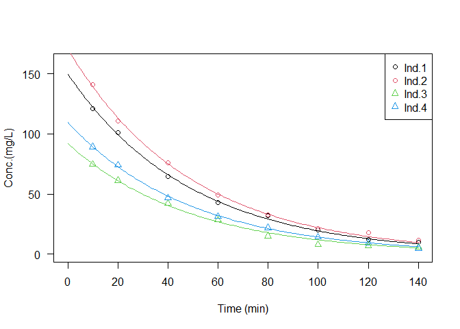<!-- -->

# Model 7:

``` r
M7 <- nlme(y ~ y0*exp(-k*t), data = gd, 
           random=y0~1,
           fixed=c(y0~1+Sex,k~1),
           start = c(y0=100,Sex=0,k=0.02))
M7
```

    ## Nonlinear mixed-effects model fit by maximum likelihood
    ##   Model: y ~ y0 * exp(-k * t) 
    ##   Data: gd 
    ##   Log-likelihood: -69.97453
    ##   Fixed: c(y0 ~ 1 + Sex, k ~ 1) 
    ## y0.(Intercept)        y0.Sex1              k 
    ##   160.08446976   -59.47947301     0.02044406 
    ## 
    ## Random effects:
    ##  Formula: y0 ~ 1 | Subject
    ##         y0.(Intercept) Residual
    ## StdDev:       9.505754 1.694789
    ## 
    ## Number of Observations: 32
    ## Number of Groups: 4

``` r
random.effects(M7)  # ranefe(M7)
```

    ##   y0.(Intercept)
    ## 3      -8.553011
    ## 4       8.553011
    ## 1     -10.182991
    ## 2      10.182991

# Plots Model M7:

``` r
##
plot(t,y,col=Subject,ylim=c(0,160),xlim=c(0,140),xlab="Time (min)",ylab = "Conc.(mg/L)",las=1,pch=as.numeric(Sex))
legend("topright",c("Ind.1","Ind.2","Ind.3","Ind.4"),pch=c(1,1,2,2),col=1:4)


tt=seq(0,140)
yW=M7$coefficients$fixed[1]
yM=M7$coefficients$fixed[1]+M7$coefficients$fixed[2]
k =M7$coefficients$fixed[3]

yW=(yW)*exp(-k*tt)
lines(tt,yW,col=i)

yM=(yM)*exp(-k*tt)
lines(tt,yM,col=i)
```

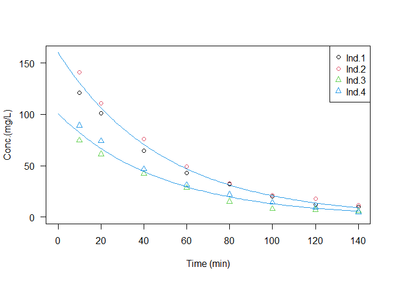<!-- -->
\# Anova M6 y M7:

``` r
##
anova(M6,M7)
```

    ##    Model df      AIC      BIC    logLik   Test  L.Ratio p-value
    ## M6     1  4 157.3843 163.2473 -74.69217                        
    ## M7     2  5 149.9491 157.2777 -69.97453 1 vs 2 9.435276  0.0021

# Model 8:

``` r
M8 <- nlme(y ~ y0*exp(-k*t), data = gd, 
           random=y0 + k ~ 1,
           fixed=y0 + k ~ 1,
           start = c(y0=100,k=0.02))
```

    ## Warning in nlme.formula(y ~ y0 * exp(-k * t), data = gd, random = y0 + k ~ :
    ## Singular precision matrix in level -1, block 1
    ## Warning in nlme.formula(y ~ y0 * exp(-k * t), data = gd, random = y0 + k ~ :
    ## Singular precision matrix in level -1, block 1
    ## Warning in nlme.formula(y ~ y0 * exp(-k * t), data = gd, random = y0 + k ~ :
    ## Singular precision matrix in level -1, block 1
    ## Warning in nlme.formula(y ~ y0 * exp(-k * t), data = gd, random = y0 + k ~ :
    ## Singular precision matrix in level -1, block 1
    ## Warning in nlme.formula(y ~ y0 * exp(-k * t), data = gd, random = y0 + k ~ :
    ## Singular precision matrix in level -1, block 1

``` r
M8
```

    ## Nonlinear mixed-effects model fit by maximum likelihood
    ##   Model: y ~ y0 * exp(-k * t) 
    ##   Data: gd 
    ##   Log-likelihood: -74.06792
    ##   Fixed: y0 + k ~ 1 
    ##           y0            k 
    ## 130.54104731   0.02057998 
    ## 
    ## Random effects:
    ##  Formula: list(y0 ~ 1, k ~ 1)
    ##  Level: Subject
    ##  Structure: General positive-definite, Log-Cholesky parametrization
    ##          StdDev       Corr  
    ## y0       3.036547e+01 y0    
    ## k        3.074487e-04 -0.994
    ## Residual 1.656931e+00       
    ## 
    ## Number of Observations: 32
    ## Number of Groups: 4

``` r
random.effects(M8)  # ranefe(M8)
```

    ##          y0             k
    ## 3 -37.47982  0.0003777559
    ## 4 -20.27122  0.0002041493
    ## 1  18.92677 -0.0001920488
    ## 2  38.82428 -0.0003898564

``` r
summary(M8)
```

    ## Nonlinear mixed-effects model fit by maximum likelihood
    ##   Model: y ~ y0 * exp(-k * t) 
    ##   Data: gd 
    ##        AIC      BIC    logLik
    ##   160.1358 168.9303 -74.06792
    ## 
    ## Random effects:
    ##  Formula: list(y0 ~ 1, k ~ 1)
    ##  Level: Subject
    ##  Structure: General positive-definite, Log-Cholesky parametrization
    ##          StdDev       Corr  
    ## y0       3.036547e+01 y0    
    ## k        3.074487e-04 -0.994
    ## Residual 1.656931e+00       
    ## 
    ## Fixed effects:  y0 + k ~ 1 
    ##        Value Std.Error DF  t-value p-value
    ## y0 130.54105 15.716706 27  8.30588       0
    ## k    0.02058  0.000301 27 68.32261       0
    ##  Correlation: 
    ##   y0   
    ## k -0.48
    ## 
    ## Standardized Within-Group Residuals:
    ##        Min         Q1        Med         Q3        Max 
    ## -2.0183127 -0.6756992 -0.1730376  0.7836142  1.7394218 
    ## 
    ## Number of Observations: 32
    ## Number of Groups: 4

``` r
##
plot(t,y,col=Subject,ylim=c(0,160),xlim=c(0,140),xlab="Time (min)",ylab = "Conc.(mg/L)",las=1,pch=as.numeric(Sex))
legend("topright",c("Ind.1","Ind.2","Ind.3","Ind.4"),pch=c(1,1,2,2),col=1:4)


tt=seq(0,140)
y0r=M8$coefficients$random$Subject
y0r=y0r[order(as.numeric(row.names(y0r))),,drop=F]
y0f=M8$coefficients$fixed[1]
k1=M8$coefficients$fixed[2]
for(i in 1:n){
  yp=(y0f+y0r[i,1])*exp(-(k1+y0r[i,2])*tt)
  lines(tt,yp,col=i)
}
```

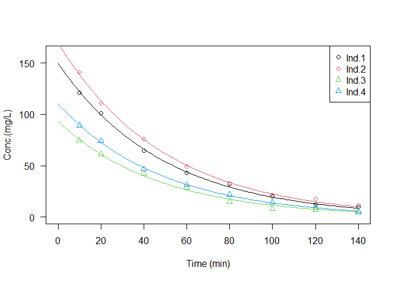<!-- -->
