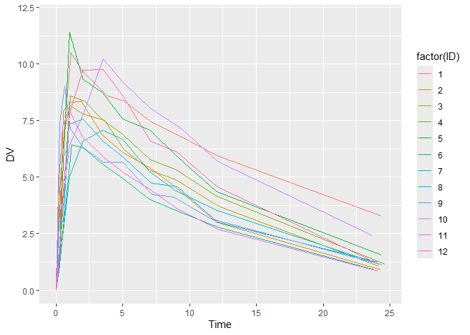
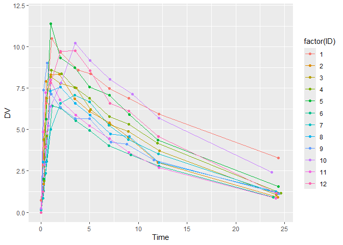
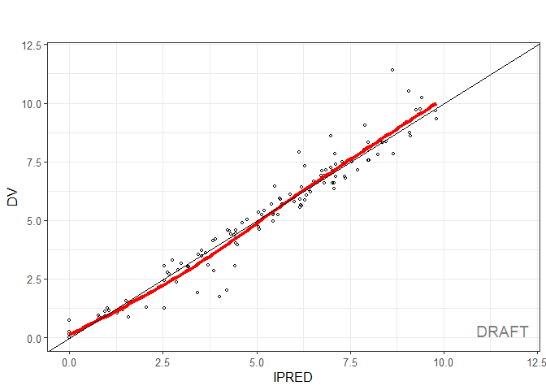

Basic Example
================
Ruben Cabrera
2023-07-24

## Basic Example

Basic Example

``` r
library(nlmixr2)
library(ggplot2)
library(dplyr) # For 
```

## Data

Multiple dose theophylline PK data

This data set is the day 1 concentrations of the theophylline data. A
data frame with 144 rows by 7 columns

ID: Subject ID TIME: Time (hrs) DV: Dependent Variable, theophylline
concentration AMT: Dose Amount/kg EVID: rxode2/nlmixr2 event ID (not
NONMEM’s) CMT: nCompartment Number WT: Weight (kg)

``` r
head(theo_sd)
```

    ##   ID TIME    DV     AMT EVID CMT   WT
    ## 1  1 0.00  0.00 319.992  101   1 79.6
    ## 2  1 0.00  0.74   0.000    0   2 79.6
    ## 3  1 0.25  2.84   0.000    0   2 79.6
    ## 4  1 0.57  6.57   0.000    0   2 79.6
    ## 5  1 1.12 10.50   0.000    0   2 79.6
    ## 6  1 2.02  9.66   0.000    0   2 79.6

``` r
summary(theo_sd)
```

    ##        ID             TIME               DV              AMT        
    ##  Min.   : 1.00   Min.   : 0.0000   Min.   : 0.000   Min.   :  0.00  
    ##  1st Qu.: 3.75   1st Qu.: 0.4675   1st Qu.: 1.500   1st Qu.:  0.00  
    ##  Median : 6.50   Median : 2.8050   Median : 4.880   Median :  0.00  
    ##  Mean   : 6.50   Mean   : 5.4034   Mean   : 4.547   Mean   : 26.29  
    ##  3rd Qu.: 9.25   3rd Qu.: 7.5775   3rd Qu.: 6.947   3rd Qu.:  0.00  
    ##  Max.   :12.00   Max.   :24.6500   Max.   :11.400   Max.   :320.65  
    ##       EVID              CMT              WT       
    ##  Min.   :  0.000   Min.   :1.000   Min.   :54.60  
    ##  1st Qu.:  0.000   1st Qu.:2.000   1st Qu.:63.58  
    ##  Median :  0.000   Median :2.000   Median :70.50  
    ##  Mean   :  8.417   Mean   :1.917   Mean   :69.58  
    ##  3rd Qu.:  0.000   3rd Qu.:2.000   3rd Qu.:74.42  
    ##  Max.   :101.000   Max.   :2.000   Max.   :86.40

``` r
str(theo_sd)
```

    ## 'data.frame':    144 obs. of  7 variables:
    ##  $ ID  : int  1 1 1 1 1 1 1 1 1 1 ...
    ##  $ TIME: num  0 0 0.25 0.57 1.12 2.02 3.82 5.1 7.03 9.05 ...
    ##  $ DV  : num  0 0.74 2.84 6.57 10.5 9.66 8.58 8.36 7.47 6.89 ...
    ##  $ AMT : num  320 0 0 0 0 ...
    ##  $ EVID: int  101 0 0 0 0 0 0 0 0 0 ...
    ##  $ CMT : int  1 2 2 2 2 2 2 2 2 2 ...
    ##  $ WT  : num  79.6 79.6 79.6 79.6 79.6 79.6 79.6 79.6 79.6 79.6 ...

## Plot data

``` r
ggplot(subset(theo_sd, EVID==0), aes(x = TIME, y = DV, group = factor(ID), color = factor(ID))) + geom_line() +  ylim(c(0, 12)) + xlab('Time')
```

<!-- -->

``` r
ggplot(filter(theo_sd,EVID==0), aes(x=TIME, y = DV, group=factor(ID), color=factor(ID))) + geom_line() + geom_point() + ylim(c(0, 12)) + xlab('Time')
```

<!-- -->

## Model

``` r
one.compartment <- function() {

#The basic model consists of an ini block that has initial estimates  
ini({
    tka <- log(1.57); label("Ka")
    tcl <- log(2.72); label("Cl")
    tv <- log(31.5); label("V")
    eta.ka ~ 0.6
    eta.cl ~ 0.3
    eta.v ~ 0.1
    add.sd <- 0.7
  })
  
# and a model block with the error specification and model specification
model({
    ka <- exp(tka + eta.ka)
    cl <- exp(tcl + eta.cl)
    v <- exp(tv + eta.v)
    d/dt(depot) <- -ka * depot
    d/dt(center) <- ka * depot - cl / v * center
    cp <- center / v
    cp ~ add(add.sd)
  })
}
```

The fit is performed by the function nlmixr/nlmixr2 specifying the
model, data and estimate

``` r
fit <- nlmixr2(one.compartment, theo_sd,  est="saem", saemControl(print=0))
```

    ## → loading into symengine environment...

    ## → pruning branches (`if`/`else`) of saem model...

    ## ✔ done

    ## → finding duplicate expressions in saem model...

    ## [====|====|====|====|====|====|====|====|====|====] 0:00:00

    ## → optimizing duplicate expressions in saem model...

    ## [====|====|====|====|====|====|====|====|====|====] 0:00:00

    ## ✔ done

    ## rxode2 2.0.13 using 6 threads (see ?getRxThreads)
    ##   no cache: create with `rxCreateCache()`

    ## Calculating covariance matrix

    ## → loading into symengine environment...

    ## → pruning branches (`if`/`else`) of saem model...

    ## ✔ done

    ## → finding duplicate expressions in saem predOnly model 0...

    ## → finding duplicate expressions in saem predOnly model 1...

    ## → optimizing duplicate expressions in saem predOnly model 1...

    ## → finding duplicate expressions in saem predOnly model 2...

    ## ✔ done

    ## → Calculating residuals/tables

    ## ✔ done

    ## → compress origData in nlmixr2 object, save 5952

    ## → compress phiM in nlmixr2 object, save 64048

    ## → compress parHist in nlmixr2 object, save 9760

    ## → compress saem0 in nlmixr2 object, save 30736

``` r
print(fit)
```

    ## ── nlmixr² SAEM OBJF by FOCEi approximation ──
    ## 
    ##  Gaussian/Laplacian Likelihoods: AIC() or $objf etc. 
    ##  FOCEi CWRES & Likelihoods: addCwres() 
    ## 
    ## ── Time (sec $time): ──
    ## 
    ##         setup covariance saem table compress other
    ## elapsed  0.01       0.01 3.91  0.06     0.09  2.38
    ## 
    ## ── Population Parameters ($parFixed or $parFixedDf): ──
    ## 
    ##        Parameter  Est.     SE %RSE Back-transformed(95%CI) BSV(CV%) Shrink(SD)%
    ## tka           Ka  0.46  0.196 42.7       1.58 (1.08, 2.33)     71.9    -0.291% 
    ## tcl           Cl  1.01 0.0839 8.29       2.75 (2.34, 3.25)     27.0      3.42% 
    ## tv             V  3.45 0.0469 1.36       31.6 (28.8, 34.7)     14.0      10.7% 
    ## add.sd           0.694                               0.694                     
    ##  
    ##   Covariance Type ($covMethod): linFim
    ##   No correlations in between subject variability (BSV) matrix
    ##   Full BSV covariance ($omega) or correlation ($omegaR; diagonals=SDs) 
    ##   Distribution stats (mean/skewness/kurtosis/p-value) available in $shrink 
    ##   Censoring ($censInformation): No censoring
    ## 
    ## ── Fit Data (object is a modified tibble): ──
    ## # A tibble: 132 × 19
    ##   ID     TIME    DV  PRED    RES IPRED   IRES  IWRES eta.ka eta.cl   eta.v    cp
    ##   <fct> <dbl> <dbl> <dbl>  <dbl> <dbl>  <dbl>  <dbl>  <dbl>  <dbl>   <dbl> <dbl>
    ## 1 1      0     0.74  0     0.74   0     0.74   1.07  0.0988 -0.484 -0.0843  0   
    ## 2 1      0.25  2.84  3.27 -0.433  3.87 -1.03  -1.49  0.0988 -0.484 -0.0843  3.87
    ## 3 1      0.57  6.57  5.85  0.718  6.82 -0.247 -0.356 0.0988 -0.484 -0.0843  6.82
    ## # ℹ 129 more rows
    ## # ℹ 7 more variables: depot <dbl>, center <dbl>, ka <dbl>, cl <dbl>, v <dbl>,
    ## #   tad <dbl>, dosenum <dbl>

The fit is performed by the function nlmixr/nlmixr2 specifying the
model, data and estimate

``` r
library(xpose.nlmixr2)
```

    ## Loading required package: xpose

    ## 
    ## Attaching package: 'xpose'

    ## The following object is masked from 'package:stats':
    ## 
    ##     filter

``` r
xpdb = xpose_data_nlmixr(fit)
```

    ## → Calculating residuals/tables

    ## ✔ done

    ## Warning in xpose_data_nlmixr(fit): Added CWRES to fit (using
    ## nlmixr2::addCwres)...

``` r
library(xpose)
plt <- dv_vs_ipred(xpdb)

library(ggPMX)
```

    ## Registered S3 method overwritten by 'GGally':
    ##   method from   
    ##   +.gg   ggplot2

    ## 
    ## Attaching package: 'ggPMX'

    ## The following object is masked from 'package:xpose':
    ## 
    ##     get_data

``` r
ctr = pmx_nlmixr(fit)
```

    ## → Add NPDE

    ## ✔ done

    ## Calculating -2LL by Gaussian quadrature (nnodes=3,nsd=1.6)

``` r
pmx_plot_dv_ipred(ctr)
```

    ## `geom_smooth()` using formula = 'y ~ x'

    ## Warning in grid.Call.graphics(C_text, as.graphicsAnnot(x$label), x$x, x$y, :
    ## font family not found in Windows font database

<!-- -->
