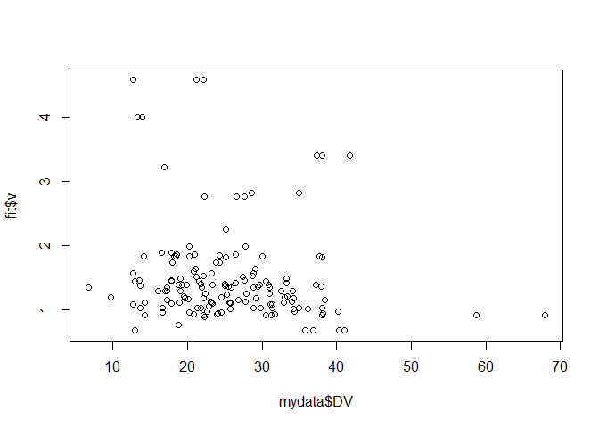
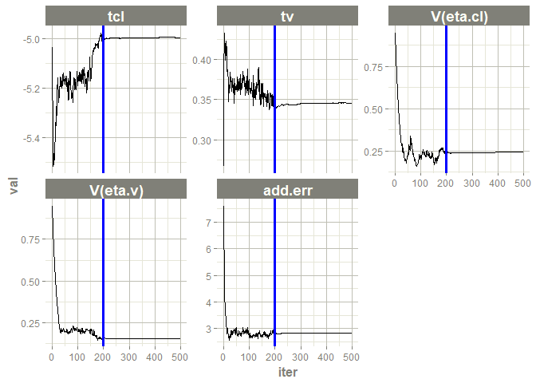
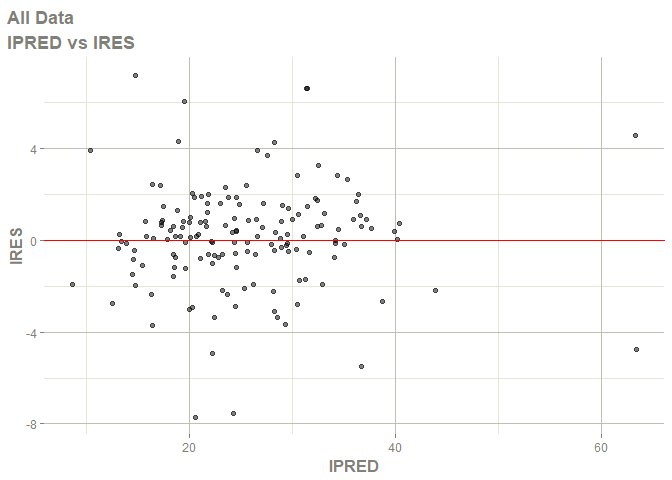
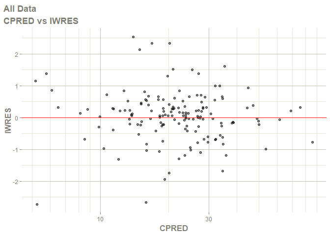
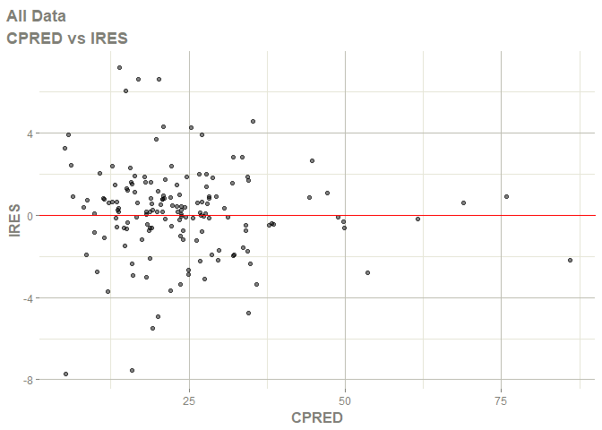
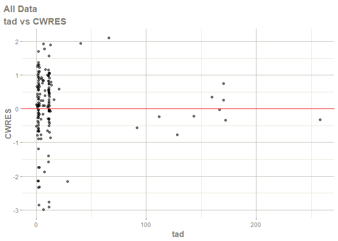
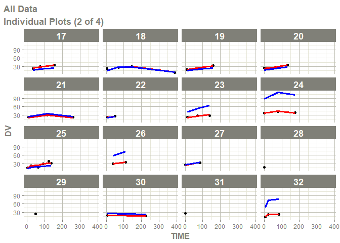
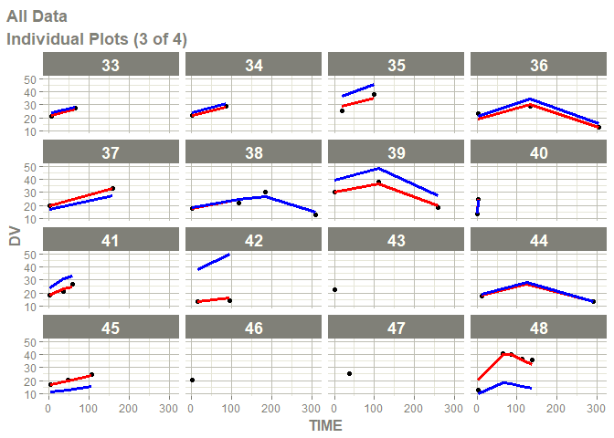

Basic Example
================
Ruben Cabrera
2023-07-29

## Basic Example

Adding Covariances between random effects
<https://nlmixr2.org/articles/addingCovariances.html>

``` r
library(nlmixr2)
library(ggplot2)
library(ggforce) # facet_wrap_paginate
library(dplyr) # For filter 
```

## Data

Phenobarbitol data:

This is from a PK study in neonatal infants. They received multiple
doses of phenobarbital for seizure prevention. A data frame with 744
rows and 8 columns

- ID: Infant ID
- TIME: Time of (hr)
- AMT: Dose in (ug/kg)
- WT: Weight (kg)
- APGR: A 5-minute Apgar score to measure infant health
- DV: The concentration of phenobarbitol in the serum (ug/mL)
- MDV: If the dependent variable (DV) is missing; 0 for observations, 1
  for doses
- EVID: Event ID

``` r
# ?pheno_sd
head(pheno_sd)
```

    ##   ID TIME  AMT  WT APGR   DV MDV EVID
    ## 1  1  0.0 25.0 1.4    7  0.0   1    1
    ## 2  1  2.0  0.0 1.4    7 17.3   0    0
    ## 3  1 12.5  3.5 1.4    7  0.0   1    1
    ## 4  1 24.5  3.5 1.4    7  0.0   1    1
    ## 5  1 37.0  3.5 1.4    7  0.0   1    1
    ## 6  1 48.0  3.5 1.4    7  0.0   1    1

``` r
summary(pheno_sd)
```

    ##        ID             TIME             AMT               WT      
    ##  Min.   : 1.00   Min.   :  0.00   Min.   : 0.000   Min.   :0.60  
    ##  1st Qu.:13.00   1st Qu.: 19.23   1st Qu.: 2.300   1st Qu.:1.10  
    ##  Median :25.00   Median : 59.30   Median : 3.000   Median :1.30  
    ##  Mean   :28.24   Mean   : 63.70   Mean   : 5.281   Mean   :1.49  
    ##  3rd Qu.:44.00   3rd Qu.: 96.42   3rd Qu.: 4.400   3rd Qu.:1.70  
    ##  Max.   :59.00   Max.   :389.80   Max.   :70.000   Max.   :3.60  
    ##       APGR              DV              MDV              EVID       
    ##  Min.   : 1.000   Min.   : 0.000   Min.   :0.0000   Min.   :0.0000  
    ##  1st Qu.: 5.000   1st Qu.: 0.000   1st Qu.:1.0000   1st Qu.:1.0000  
    ##  Median : 7.000   Median : 0.000   Median :1.0000   Median :1.0000  
    ##  Mean   : 6.394   Mean   : 5.328   Mean   :0.7917   Mean   :0.7917  
    ##  3rd Qu.: 8.000   3rd Qu.: 0.000   3rd Qu.:1.0000   3rd Qu.:1.0000  
    ##  Max.   :10.000   Max.   :67.900   Max.   :1.0000   Max.   :1.0000

``` r
str(pheno_sd)
```

    ## 'data.frame':    744 obs. of  8 variables:
    ##  $ ID  : int  1 1 1 1 1 1 1 1 1 1 ...
    ##  $ TIME: num  0 2 12.5 24.5 37 48 60.5 72.5 85.3 96.5 ...
    ##  $ AMT : num  25 0 3.5 3.5 3.5 3.5 3.5 3.5 3.5 3.5 ...
    ##  $ WT  : num  1.4 1.4 1.4 1.4 1.4 1.4 1.4 1.4 1.4 1.4 ...
    ##  $ APGR: int  7 7 7 7 7 7 7 7 7 7 ...
    ##  $ DV  : num  0 17.3 0 0 0 0 0 0 0 0 ...
    ##  $ MDV : int  1 0 1 1 1 1 1 1 1 1 ...
    ##  $ EVID: int  1 0 1 1 1 1 1 1 1 1 ...

``` r
# Plot data AMT Dose in (ug/kg)
ggplot(filter(pheno_sd,EVID==1), aes(x=TIME, y = AMT, group=factor(ID), color=factor(ID))) + geom_line() + geom_point() + ylim(c(0, 70)) + xlab('Time')
```

<!-- -->

``` r
## Plot data DV concentration of phenobarbitol

ggplot(filter(pheno_sd,EVID==0), aes(x=TIME, y = DV, group=factor(ID), color=factor(ID))) + geom_line() + geom_point() + ylim(c(0, 70)) + xlab('Time')
```

<!-- -->

``` r
# Could be interesting plot AMT vs DV (using the last data recorded in both axis)
```

``` r
# The superposition of doses as vertical black lines on concentration profiles

pAMT <- geom_segment(data=filter(pheno_sd,EVID==1), aes(x=TIME, xend=TIME, y=0, yend=AMT), size=1)
```

    ## Warning: Using `size` aesthetic for lines was deprecated in ggplot2 3.4.0.
    ## ℹ Please use `linewidth` instead.
    ## This warning is displayed once every 8 hours.
    ## Call `lifecycle::last_lifecycle_warnings()` to see where this warning was
    ## generated.

``` r
pDV <- geom_point(data=filter(pheno_sd,EVID==0), aes(x=TIME, y=DV,  color=factor(ID)), size=3)

ggplot() + pAMT
```

<!-- -->

``` r
ggplot() + pDV
```

<!-- -->

``` r
ggplot() + pAMT + pDV + facet_wrap_paginate(ID~., ncol=3, nrow=3, page=1) + theme(legend.position="none") + ylab("Dose and Concentration (mg/L)")
```

<!-- -->

## Model

``` r
pheno <- function() {
  ini({
    tcl <- log(0.008) # typical value of clearance
    tv <-  log(0.6)   # typical value of volume
    ## var(eta.cl)
    eta.cl + eta.v ~ c(1, 0.01, 1) ## cov(eta.cl, eta.v), var(eta.v)
                      # interindividual variability on clearance and volume
    add.err <- 0.1    # residual variability
  })
  model({
    cl <- exp(tcl + eta.cl) # individual value of clearance
    v <- exp(tv + eta.v)    # individual value of volume
    ke <- cl / v            # elimination rate constant
    d/dt(A1) = - ke * A1    # model differential equation
    cp = A1 / v             # concentration in plasma
    cp ~ add(add.err)       # define error model
  })
}
```

The fit is performed by the function nlmixr/nlmixr2 specifying the
model, data and estimate

``` r
fit <- nlmixr(pheno, pheno_sd, "saem", control=list(print=0), table=list(cwres=TRUE, npde=TRUE))
```

    ## ℹ parameter labels from comments will be replaced by 'label()'

    ## → loading into symengine environment...

    ## → pruning branches (`if`/`else`) of saem model...

    ## ✔ done

    ## → finding duplicate expressions in saem model...

    ## [====|====|====|====|====|====|====|====|====|====] 0:00:00

    ## ✔ done

    ## using C compiler: 'gcc.exe (GCC) 12.3.0'

    ## rxode2 2.0.13 using 6 threads (see ?getRxThreads)
    ##   no cache: create with `rxCreateCache()`

    ## Calculating covariance matrix

    ## → loading into symengine environment...

    ## → pruning branches (`if`/`else`) of saem model...

    ## ✔ done

    ## → finding duplicate expressions in saem predOnly model 0...

    ## → finding duplicate expressions in saem predOnly model 1...

    ## → finding duplicate expressions in saem predOnly model 2...

    ## ✔ done

    ## using C compiler: 'gcc.exe (GCC) 12.3.0'

    ## → Calculating residuals/tables

    ## → loading into symengine environment...

    ## → pruning branches (`if`/`else`) of full model...

    ## ✔ done

    ## → calculate jacobian

    ## → calculate sensitivities

    ## → calculate ∂(f)/∂(η)

    ## → calculate ∂(R²)/∂(η)

    ## → finding duplicate expressions in inner model...

    ## → optimizing duplicate expressions in inner model...

    ## → finding duplicate expressions in EBE model...

    ## → optimizing duplicate expressions in EBE model...

    ## → compiling inner model...

    ## ✔ done

    ## → finding duplicate expressions in FD model...

    ## → optimizing duplicate expressions in FD model...

    ## → compiling EBE model...

    ## using C compiler: 'gcc.exe (GCC) 12.3.0'

    ## ✔ done

    ## → compiling events FD model...

    ## ✔ done

    ## using C compiler: 'gcc.exe (GCC) 12.3.0'

    ## ✔ done

    ## → compress origData in nlmixr2 object, save 33192

    ## → compress phiM in nlmixr2 object, save 233144

    ## → compress parHist in nlmixr2 object, save 7880

    ## → loading into symengine environment...

    ## → pruning branches (`if`/`else`) of full model...

    ## ✔ done

    ## → calculate jacobian

    ## → calculate sensitivities

    ## → calculate ∂(f)/∂(η)

    ## → calculate ∂(R²)/∂(η)

    ## → finding duplicate expressions in inner model...

    ## → optimizing duplicate expressions in inner model...

    ## → finding duplicate expressions in EBE model...

    ## → optimizing duplicate expressions in EBE model...

    ## → compiling inner model...

    ## ✔ done

    ## → finding duplicate expressions in FD model...

    ## → optimizing duplicate expressions in FD model...

    ## → compiling EBE model...

    ## ✔ done

    ## → compiling events FD model...

    ## ✔ done

``` r
print(fit)
```

    ## ── nlmixr² SAEM OBJF by FOCEi approximation ──
    ## 
    ##           OBJF      AIC      BIC Log-likelihood Condition#(Cov) Condition#(Cor)
    ## FOCEi 688.6792 985.5502 1003.811      -486.7751        7.570439        6.604927
    ## 
    ## ── Time (sec $time): ──
    ## 
    ##         setup optimize covariance  saem table compress
    ## elapsed 0.008        0       0.02 17.25 10.05     0.13
    ## 
    ## ── Population Parameters ($parFixed or $parFixedDf): ──
    ## 
    ##                          Parameter  Est.     SE %RSE    Back-transformed(95%CI)
    ## tcl     typical value of clearance -4.99 0.0743 1.49 0.00677 (0.00586, 0.00784)
    ## tv         typical value of volume 0.346 0.0538 15.5          1.41 (1.27, 1.57)
    ## add.err       residual variability  2.83                                   2.83
    ##         BSV(CV%) Shrink(SD)%
    ## tcl         52.4      1.50% 
    ## tv          41.0      1.09% 
    ## add.err                     
    ##  
    ##   Covariance Type ($covMethod): linFim
    ##   Correlations in between subject variability (BSV) matrix:
    ##     cor:eta.v,eta.cl 
    ##           0.989  
    ##  
    ## 
    ##   Full BSV covariance ($omega) or correlation ($omegaR; diagonals=SDs) 
    ##   Distribution stats (mean/skewness/kurtosis/p-value) available in $shrink 
    ##   Censoring ($censInformation): No censoring
    ## 
    ## ── Fit Data (object is a modified tibble): ──
    ## # A tibble: 155 × 26
    ##   ID     TIME    DV EPRED  ERES   NPDE     NPD   PDE    PD  PRED    RES    WRES
    ##   <fct> <dbl> <dbl> <dbl> <dbl>  <dbl>   <dbl> <dbl> <dbl> <dbl>  <dbl>   <dbl>
    ## 1 1        2   17.3  18.8 -1.53 -0.422  0.0167 0.337 0.507  17.5 -0.222 -0.0297
    ## 2 1      112.  31    29.9  1.15  0.394  0.394  0.653 0.653  27.9  3.11   0.254 
    ## 3 2        2    9.7  10.9 -1.18 -0.994 -0.193  0.16  0.423  10.5 -0.813 -0.162 
    ## # ℹ 152 more rows
    ## # ℹ 14 more variables: IPRED <dbl>, IRES <dbl>, IWRES <dbl>, CPRED <dbl>,
    ## #   CRES <dbl>, CWRES <dbl>, eta.cl <dbl>, eta.v <dbl>, A1 <dbl>, cl <dbl>,
    ## #   v <dbl>, ke <dbl>, tad <dbl>, dosenum <dbl>

Output description

``` r
# Estimation of DV: PRED and IPRED

mydata <- pheno_sd[pheno_sd$EVID==0,]
plot(mydata$DV,fit$PRED)
```

<!-- -->

``` r
plot(mydata$DV,fit$IPRED)
```

<!-- -->

``` r
plot(mydata$DV,fit$EPRED)
```

<!-- -->

``` r
# What is the difference between PRED and IPRED?
  
# eta.ka:
plot(mydata$ID,fit$eta.ka)
```

<!-- -->

``` r
plot(mydata$ID,fit$eta.cl)
```

<!-- -->

``` r
plot(mydata$ID,fit$eta.v)
```

<!-- -->

``` r
plot(mydata$ID,fit$cp)
```

<!-- -->

``` r
plot(mydata$DV,fit$cp)
```

<!-- -->

``` r
plot(mydata$DV,fit$depot)
```

<!-- -->

``` r
plot(mydata$DV,fit$center)   
```

<!-- -->

``` r
plot(mydata$DV,fit$ka)
```

<!-- -->

``` r
plot(mydata$DV,fit$cl)
```

<!-- -->

``` r
plot(mydata$DV,fit$v)
```

<!-- -->

``` r
plot(mydata$DV,fit$tad)
```

<!-- -->

``` r
plot(mydata$DV,fit$depot)
```

<!-- -->

``` r
plot(mydata$DV,fit$dosenum)
```

<!-- -->

Plots

``` r
library(xpose.nlmixr2)
```

    ## Loading required package: xpose

    ## 
    ## Attaching package: 'xpose'

    ## The following object is masked from 'package:stats':
    ## 
    ##     filter

``` r
xpdb = xpose_data_nlmixr(fit)


library(xpose)
plt <- dv_vs_ipred(xpdb)

library(ggPMX)
```

    ## Registered S3 method overwritten by 'GGally':
    ##   method from   
    ##   +.gg   ggplot2

    ## 
    ## Attaching package: 'ggPMX'

    ## The following object is masked from 'package:xpose':
    ## 
    ##     get_data

``` r
ctr = pmx_nlmixr(fit)
```

    ## using C compiler: 'gcc.exe (GCC) 12.3.0'

``` r
pmx_plot_dv_ipred(ctr)
```

    ## `geom_smooth()` using formula = 'y ~ x'

    ## Warning in grid.Call.graphics(C_text, as.graphicsAnnot(x$label), x$x, x$y, :
    ## font family not found in Windows font database

<!-- -->

Plots

``` r
plot(fit)
```

<!-- --><!-- --><!-- --><!-- --><!-- --><!-- --><!-- --><!-- --><!-- --><!-- --><!-- --><!-- --><!-- --><!-- --><!-- --><!-- --><!-- --><!-- --><!-- --><!-- --><!-- --><!-- --><!-- --><!-- --><!-- --><!-- --><!-- --><!-- --><!-- --><!-- --><!-- --><!-- --><!-- --><!-- --><!-- --><!-- --><!-- --><!-- --><!-- --><!-- --><!-- --><!-- --><!-- --><!-- --><!-- --><!-- --><!-- --><!-- --><!-- --><!-- --><!-- --><!-- --><!-- --><!-- --><!-- --><!-- --><!-- --><!-- --><!-- --><!-- --><!-- --><!-- --><!-- --><!-- --><!-- --><!-- --><!-- -->

    ## `geom_line()`: Each group consists of only one observation.
    ## ℹ Do you need to adjust the group aesthetic?
    ## `geom_line()`: Each group consists of only one observation.
    ## ℹ Do you need to adjust the group aesthetic?

<!-- -->

    ## `geom_line()`: Each group consists of only one observation.
    ## ℹ Do you need to adjust the group aesthetic?
    ## `geom_line()`: Each group consists of only one observation.
    ## ℹ Do you need to adjust the group aesthetic?
    ## `geom_line()`: Each group consists of only one observation.
    ## ℹ Do you need to adjust the group aesthetic?
    ## `geom_line()`: Each group consists of only one observation.
    ## ℹ Do you need to adjust the group aesthetic?
    ## `geom_line()`: Each group consists of only one observation.
    ## ℹ Do you need to adjust the group aesthetic?
    ## `geom_line()`: Each group consists of only one observation.
    ## ℹ Do you need to adjust the group aesthetic?

<!-- -->

    ## `geom_line()`: Each group consists of only one observation.
    ## ℹ Do you need to adjust the group aesthetic?
    ## `geom_line()`: Each group consists of only one observation.
    ## ℹ Do you need to adjust the group aesthetic?
    ## `geom_line()`: Each group consists of only one observation.
    ## ℹ Do you need to adjust the group aesthetic?
    ## `geom_line()`: Each group consists of only one observation.
    ## ℹ Do you need to adjust the group aesthetic?
    ## `geom_line()`: Each group consists of only one observation.
    ## ℹ Do you need to adjust the group aesthetic?
    ## `geom_line()`: Each group consists of only one observation.
    ## ℹ Do you need to adjust the group aesthetic?

<!-- -->

    ## `geom_line()`: Each group consists of only one observation.
    ## ℹ Do you need to adjust the group aesthetic?
    ## `geom_line()`: Each group consists of only one observation.
    ## ℹ Do you need to adjust the group aesthetic?
    ## `geom_line()`: Each group consists of only one observation.
    ## ℹ Do you need to adjust the group aesthetic?
    ## `geom_line()`: Each group consists of only one observation.
    ## ℹ Do you need to adjust the group aesthetic?

<!-- -->
