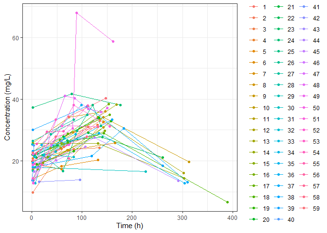
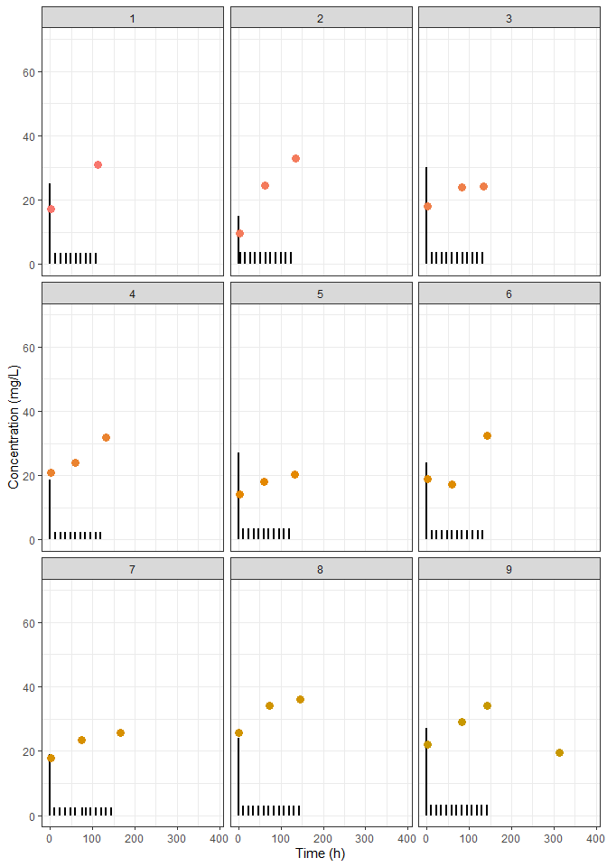
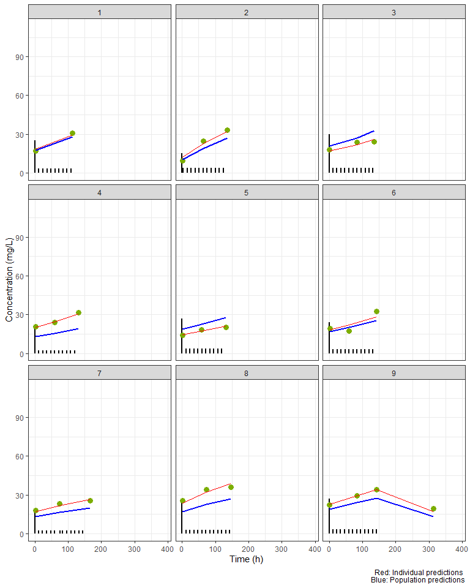
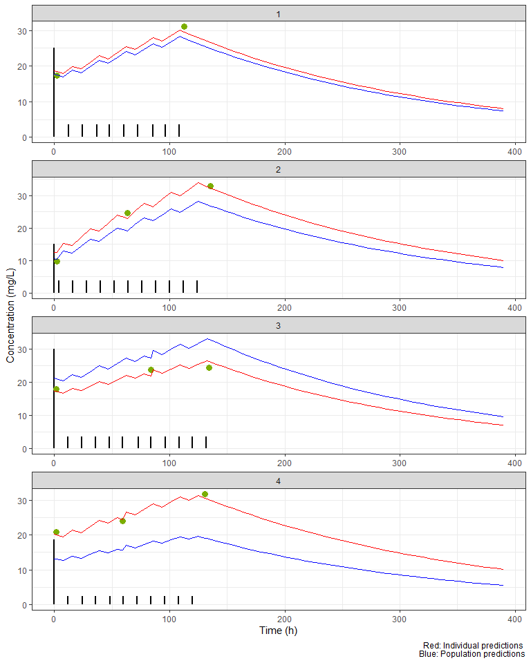

NLMIXR_Intro
================
Renan Cabrera
2023-07-01

``` r
rm(list = ls())

library(dplyr)
library(ggplot2)
library(ggforce)

library(ggstance)

library(tidyr)
library(comprehenr)

library(kableExtra)

library(purrr)

library(nlmixr2)
```

# Introduction

This documents is an introduction of Non Linear Mixed Effects with the
help of the R package nlmixr2. This example is based on:
<https://nlmixr2.org/articles/addingCovariances.html>

# Data

The data corresponds to Phenobarbitol, which is automatically loaded
with nlmixr2

``` r
#pheno_sd
str(pheno_sd)
```

    ## 'data.frame':    744 obs. of  8 variables:
    ##  $ ID  : int  1 1 1 1 1 1 1 1 1 1 ...
    ##  $ TIME: num  0 2 12.5 24.5 37 48 60.5 72.5 85.3 96.5 ...
    ##  $ AMT : num  25 0 3.5 3.5 3.5 3.5 3.5 3.5 3.5 3.5 ...
    ##  $ WT  : num  1.4 1.4 1.4 1.4 1.4 1.4 1.4 1.4 1.4 1.4 ...
    ##  $ APGR: int  7 7 7 7 7 7 7 7 7 7 ...
    ##  $ DV  : num  0 17.3 0 0 0 0 0 0 0 0 ...
    ##  $ MDV : int  1 0 1 1 1 1 1 1 1 1 ...
    ##  $ EVID: int  1 0 1 1 1 1 1 1 1 1 ...

The columns are defined as

- ID: Identification of individual.
- TIME: Time
- AMT: Amount of drug dose.
- WT: Weight. This is a covariate
- APGR: Apgar score. This is a covariate
- DV: Dependent variable observed. This is the measured concentration in
  blood plasma.
- MDV: Missing dependent variable. This is 1 whenever the row value is
  not an DV observation. If MDV=0, DV must be used, otherwise DV must be
  ignored.
- EVID: EVID=0 for dependent variable observed. EVID=1 for dose record.
  The AMT column should be used.

The naming of the columns ID, TIME, AMT, DV, MDV and EVID follows the
NONMEN convention. More information can be found at:

- Bauer, Robert J. “NONMEM tutorial part I: description of commands and
  options, with simple examples of population analysis.” CPT:
  pharmacometrics & systems pharmacology 8.8 (2019): 525-537.

``` r
p <- ggplot( data= filter(pheno_sd,EVID==0),  
             aes(x=TIME,y=DV, group=factor(ID), color=factor(ID) ))
p <- p + geom_line() + geom_point()
p <- p + theme_bw()
p <- p + xlab("Time (h)") + ylab("Concentration (mg/L)")
p #+ facet_wrap(WT~.)
```

<!-- --> The
superposition of doses as vertical black lines on concentration profiles

``` r
p <- ggplot( )
p <- p +  geom_segment( 
  data= filter(pheno_sd,EVID==1),
  aes(x=TIME, xend=TIME, y=0,yend=AMT), size=1 )
```

    ## Warning: Using `size` aesthetic for lines was deprecated in ggplot2 3.4.0.
    ## ℹ Please use `linewidth` instead.
    ## This warning is displayed once every 8 hours.
    ## Call `lifecycle::last_lifecycle_warnings()` to see where this warning was
    ## generated.

``` r
p <- p +  geom_point(
  data= filter(pheno_sd,EVID==0),
  aes(x=TIME, y=DV, color=factor(ID) ), size=3 )

p <- p + theme_bw()
p <- p + xlab("Time (h)") + ylab("Concentration (mg/L)")
p <- p + theme(legend.position="none")
p + facet_wrap_paginate(ID~., ncol=3, nrow=3, page=1)
```

<!-- -->

# Model

The differential equation for the amount is

$$ \frac{A_1}{dt } = - k_e A_1 $$

The concentration is

$$C_p = \frac{A_1}{V}
$$

The clearance is defined from $$k_e = \frac{CL}{V}$$ It is usual to
parametrize the model in terms of clearance and volume instead of $k_e$.

The actual fitting parametrization is carried out in term of so called
typical values $LogTVCL$ and $LogTVV$:

$$
\begin{align}
  CL =& \exp( LogTVCL + \eta_{CL} )  \\
  V  =& \exp( LogTVV  + \eta_{V} ) 
\end{align}
$$ where $\eta_{CL}$ and $\eta_{V}$ are random variables obeying normal
distributions with a covariance matrix $\Omega$ (mean zero). The
components of $\Omega$ are then additional fit parameters. The matrix
$\Omega$ and the variables $\eta$ are responsible to explain random
inter-individual variability.

$$(\eta_{CL} , \eta_{V}) \approx   N(0, \Omega)  $$ If $\Omega$ is a
diagonal matrix, the inter-individual variabilities are independent.
Otherwise, they have some correlation.

The residual error model provides the final random variability on the
predicted concentration. The residual error model in this example is
$$C_{obs} = C_p + \varepsilon$$, where $\varepsilon$ is a normal random
variable (specified by $add.err=\sigma^2$).
$$ \varepsilon \approx N(0, \sigma^2) $$

``` r
pheno <- function() {
  ini({
    LogTVCL <- log(0.008) # typical value of log clearance with initial value CL=0.008
    LogTVV <-  log(0.6)   # typical value of log volume with initial value V=0.6 
    ## var(eta.cl)
    eta.cl + eta.v ~ c(1, 
                       0.01, 1) ## cov(eta.cl, eta.v), var(eta.v)
                      # interindividual variability on clearance and volume
    add.err <- 0.1    # residual variability
  })
  model({
    cl <- exp(LogTVCL + eta.cl) # individual value of clearance
    v <- exp(LogTVV + eta.v)    # individual value of volume
    ke <- cl / v            # elimination rate constant
    d/dt(A1) = - ke * A1    # model differential equation
    cp = A1 / v             # concentration in plasma
    cp ~ add(add.err)       # define residual error model
  })
}
```

Fit with the SAEM method (stochastic optimization)

``` r
fit <- nlmixr(pheno, pheno_sd, "saem",
              control=list(print=0), 
              table=list(cwres=TRUE, npde=TRUE))
```

    ## [====|====|====|====|====|====|====|====|====|====] 0:00:00

``` r
str(fit)
```

    ## nlmxr2FD [155 × 26] (S3: nlmixr2FitData/nlmixr2FitCore/nlmixr2.saem/tbl_df/tbl/data.frame)
    ##  $ ID     : Factor w/ 59 levels "1","2","3","4",..: 1 1 2 2 2 3 3 3 4 4 ...
    ##  $ TIME   : num [1:155] 2 112.5 2 63.5 135.5 ...
    ##  $ DV     : num [1:155] 17.3 31 9.7 24.6 33 18 23.8 24.3 20.8 23.9 ...
    ##  $ EPRED  : num [1:155] 18.8 29.9 10.9 20 27.6 ...
    ##  $ ERES   : num [1:155] -1.53 1.15 -1.18 4.61 5.35 ...
    ##  $ NPDE   : num [1:155] -0.422 0.394 -0.994 -0.358 0.553 ...
    ##  $ NPD    : num [1:155] 0.0167 0.3943 -0.1934 0.664 0.5534 ...
    ##  $ PDE    : num [1:155] 0.337 0.653 0.16 0.36 0.71 ...
    ##  $ PD     : num [1:155] 0.507 0.653 0.423 0.747 0.71 ...
    ##  $ PRED   : num [1:155] 17.5 27.9 10.5 19.2 26.9 ...
    ##  $ RES    : num [1:155] -0.222 3.11 -0.813 5.395 6.113 ...
    ##  $ WRES   : num [1:155] -0.0297 0.2545 -0.1618 0.6382 0.5135 ...
    ##  $ IPRED  : num [1:155] 18.5 29.6 12.5 23 32.4 ...
    ##  $ IRES   : num [1:155] -1.184 1.374 -2.771 1.619 0.615 ...
    ##  $ IWRES  : num [1:155] -0.418 0.485 -0.978 0.571 0.217 ...
    ##  $ CPRED  : num [1:155] 17.5 27.8 10.3 18.9 26.4 ...
    ##  $ CRES   : num [1:155] -0.196 3.161 -0.641 5.739 6.631 ...
    ##  $ CWRES  : num [1:155] -0.025 0.245 -0.113 0.578 0.468 ...
    ##  $ eta.cl : num [1:155] -0.0743 -0.0743 -0.2123 -0.2123 -0.2123 ...
    ##  $ eta.v  : num [1:155] -0.0533 -0.0533 -0.1704 -0.1704 -0.1704 ...
    ##  $ A1     : num [1:155] 24.8 39.7 14.9 27.4 38.6 ...
    ##  $ cl     : num [1:155] 0.00629 0.00629 0.00548 0.00548 0.00548 ...
    ##  $ v      : num [1:155] 1.34 1.34 1.19 1.19 1.19 ...
    ##  $ ke     : num [1:155] 0.00469 0.00469 0.0046 0.0046 0.0046 ...
    ##  $ tad    : num [1:155] 2 4 2 11.5 11.5 ...
    ##  $ dosenum: num [1:155] 1 10 1 6 12 1 7 12 1 5 ...
    ##  $ cor       :  correlation matrix of theta, calculated from covariance of theta
    ##  $ finalUi   :  The final ui used to run the model
    ##  $ foceiControl:  Get the focei control required for creating the nlmixr object
    ##  $ iniUi     :  The initial ui used to run the model
    ##  $ ipredModel:  rxode2 estimation model for fit
    ##  $ modelName :  name of the model used for nlmixr2 model fit
    ##  $ omegaR    :  correlation matrix of omega
    ##  $ parHistStacked:  stacked parameter history
    ##  $ phiR      :  correlation matrix of each individual's eta (if present)
    ##  $ phiRSE    :  relative standard error of each individual's eta (if present)
    ##  $ phiSE     :  standard error of each individual's eta (if present)
    ##  $ rxControl :  rxode2 solving options
    ##  $ ui        :  The final ui used to run the model
    ##  $ ui        :  rxode2 user interface
    ##  $ conditionNumberCor:  Condition Number (Correlation)
    ##  $ conditionNumberCov:  Condition Number (Covariance)
    ##  $ cov       :  Covariance of fixed effects
    ##  $ covMethod :  Covariance Method for fixed effects
    ##  $ etaObf    :  ETAs and their individual objective function contribution (if applicable)
    ##  $ objDf     :  Objective Function DF
    ##  $ omega     :  Omega Matrix
    ##  $ origData  :  Original Data
    ##  $ parFixed  :  Formatted Parameter Values for Fixed effects
    ##  $ parFixedDf:  Parameter Values for Fixed Effects (data frame)
    ##  $ parHist   :  Parameter History
    ##  $ scaleInfo :  Scaling Information
    ##  $ shrink    :  Shrinkage data frame
    ##  $ table     :  Table Control Value
    ##  $ fixef     :  Fixed effects
    ##  $ time      :  Timing data frame

The final objective function and associated values

``` r
fit$objDf         %>% kable %>% kable_styling()
```

<table class="table" style="margin-left: auto; margin-right: auto;">
<thead>
<tr>
<th style="text-align:left;">
</th>
<th style="text-align:right;">
OBJF
</th>
<th style="text-align:right;">
AIC
</th>
<th style="text-align:right;">
BIC
</th>
<th style="text-align:right;">
Log-likelihood
</th>
<th style="text-align:right;">
Condition#(Cov)
</th>
<th style="text-align:right;">
Condition#(Cor)
</th>
</tr>
</thead>
<tbody>
<tr>
<td style="text-align:left;">
FOCEi
</td>
<td style="text-align:right;">
688.6792
</td>
<td style="text-align:right;">
985.5502
</td>
<td style="text-align:right;">
1003.811
</td>
<td style="text-align:right;">
-486.7751
</td>
<td style="text-align:right;">
7.570439
</td>
<td style="text-align:right;">
6.604927
</td>
</tr>
</tbody>
</table>

The fitted parameters are

``` r
fit$parFixedDf %>% kable %>% kable_styling()
```

<table class="table" style="margin-left: auto; margin-right: auto;">
<thead>
<tr>
<th style="text-align:left;">
</th>
<th style="text-align:left;">
Parameter
</th>
<th style="text-align:right;">
Estimate
</th>
<th style="text-align:right;">
SE
</th>
<th style="text-align:right;">
%RSE
</th>
<th style="text-align:right;">
Back-transformed
</th>
<th style="text-align:right;">
CI Lower
</th>
<th style="text-align:right;">
CI Upper
</th>
<th style="text-align:right;">
BSV(CV%)
</th>
<th style="text-align:right;">
Shrink(SD)%
</th>
</tr>
</thead>
<tbody>
<tr>
<td style="text-align:left;">
LogTVCL
</td>
<td style="text-align:left;">
typical value of log clearance with initial value CL=0.008
</td>
<td style="text-align:right;">
-4.9946697
</td>
<td style="text-align:right;">
0.0742765
</td>
<td style="text-align:right;">
1.487114
</td>
<td style="text-align:right;">
0.006774
</td>
<td style="text-align:right;">
0.0058562
</td>
<td style="text-align:right;">
0.0078355
</td>
<td style="text-align:right;">
52.35460
</td>
<td style="text-align:right;">
1.501635
</td>
</tr>
<tr>
<td style="text-align:left;">
LogTVV
</td>
<td style="text-align:left;">
typical value of log volume with initial value V=0.6
</td>
<td style="text-align:right;">
0.3458435
</td>
<td style="text-align:right;">
0.0537702
</td>
<td style="text-align:right;">
15.547562
</td>
<td style="text-align:right;">
1.413181
</td>
<td style="text-align:right;">
1.2718287
</td>
<td style="text-align:right;">
1.5702443
</td>
<td style="text-align:right;">
40.95882
</td>
<td style="text-align:right;">
1.090800
</td>
</tr>
<tr>
<td style="text-align:left;">
add.err
</td>
<td style="text-align:left;">
residual variability
</td>
<td style="text-align:right;">
2.8342748
</td>
<td style="text-align:right;">
NA
</td>
<td style="text-align:right;">
NA
</td>
<td style="text-align:right;">
2.834275
</td>
<td style="text-align:right;">
NA
</td>
<td style="text-align:right;">
NA
</td>
<td style="text-align:right;">
NA
</td>
<td style="text-align:right;">
NA
</td>
</tr>
</tbody>
</table>

where Back transformed is the exponential of the actual estimations in
the log scale.

The estimated $\Omega$ covariance matrix is

``` r
as.data.frame( fit$omega ) %>% kable %>% kable_styling()
```

<table class="table" style="margin-left: auto; margin-right: auto;">
<thead>
<tr>
<th style="text-align:left;">
</th>
<th style="text-align:right;">
eta.cl
</th>
<th style="text-align:right;">
eta.v
</th>
</tr>
</thead>
<tbody>
<tr>
<td style="text-align:left;">
eta.cl
</td>
<td style="text-align:right;">
0.2422403
</td>
<td style="text-align:right;">
0.1916460
</td>
</tr>
<tr>
<td style="text-align:left;">
eta.v
</td>
<td style="text-align:right;">
0.1916460
</td>
<td style="text-align:right;">
0.1550895
</td>
</tr>
</tbody>
</table>

Additionally, the output contains time series

``` r
fit.time.series <- as.data.frame(fit)
```

This time series contains as many rows as many concentration
observations.

``` r
nrow(fit.time.series)
```

    ## [1] 155

``` r
str(fit.time.series)
```

    ## 'data.frame':    155 obs. of  26 variables:
    ##  $ ID     : Factor w/ 59 levels "1","2","3","4",..: 1 1 2 2 2 3 3 3 4 4 ...
    ##  $ TIME   : num  2 112.5 2 63.5 135.5 ...
    ##  $ DV     : num  17.3 31 9.7 24.6 33 18 23.8 24.3 20.8 23.9 ...
    ##  $ EPRED  : num  18.8 29.9 10.9 20 27.6 ...
    ##  $ ERES   : num  -1.53 1.15 -1.18 4.61 5.35 ...
    ##  $ NPDE   : num  -0.422 0.394 -0.994 -0.358 0.553 ...
    ##  $ NPD    : num  0.0167 0.3943 -0.1934 0.664 0.5534 ...
    ##  $ PDE    : num  0.337 0.653 0.16 0.36 0.71 ...
    ##  $ PD     : num  0.507 0.653 0.423 0.747 0.71 ...
    ##  $ PRED   : num  17.5 27.9 10.5 19.2 26.9 ...
    ##  $ RES    : num  -0.222 3.11 -0.813 5.395 6.113 ...
    ##  $ WRES   : num  -0.0297 0.2545 -0.1618 0.6382 0.5135 ...
    ##  $ IPRED  : num  18.5 29.6 12.5 23 32.4 ...
    ##  $ IRES   : num  -1.184 1.374 -2.771 1.619 0.615 ...
    ##  $ IWRES  : num  -0.418 0.485 -0.978 0.571 0.217 ...
    ##  $ CPRED  : num  17.5 27.8 10.3 18.9 26.4 ...
    ##  $ CRES   : num  -0.196 3.161 -0.641 5.739 6.631 ...
    ##  $ CWRES  : num  -0.025 0.245 -0.113 0.578 0.468 ...
    ##  $ eta.cl : num  -0.0743 -0.0743 -0.2123 -0.2123 -0.2123 ...
    ##  $ eta.v  : num  -0.0533 -0.0533 -0.1704 -0.1704 -0.1704 ...
    ##  $ A1     : num  24.8 39.7 14.9 27.4 38.6 ...
    ##  $ cl     : num  0.00629 0.00629 0.00548 0.00548 0.00548 ...
    ##  $ v      : num  1.34 1.34 1.19 1.19 1.19 ...
    ##  $ ke     : num  0.00469 0.00469 0.0046 0.0046 0.0046 ...
    ##  $ tad    : num  2 4 2 11.5 11.5 ...
    ##  $ dosenum: num  1 10 1 6 12 1 7 12 1 5 ...

The definition of some columns:

- PRED: The concentration without inter-individual variability $\eta=0$
  also known as population concentration prediction.

- IPRED: The concentration with inter-individual variability.

The superposition of doses as vertical black lines on concentration
profiles

``` r
p <- ggplot( )
p <- p +  geom_segment( 
  data= filter(pheno_sd,EVID==1),
  aes(x=TIME, xend=TIME, y=0,yend=AMT), size=1 )

p <- p +  geom_point(
  data= filter(pheno_sd,EVID==0),
  aes(x=TIME, y=DV ), size=3, color="#7CAE00" )

p <- p + geom_line(
    data=fit.time.series,
    aes(x=TIME,y=PRED  ), color="blue", size=1 )

p <- p + geom_line(
    data=fit.time.series,
    aes(x=TIME,y=IPRED  ), color="red" )


p <- p + theme_bw()
p <- p + xlab("Time (h)") + ylab("Concentration (mg/L)")
p <- p + theme(legend.position="none")
p <- p + labs(caption = "Red: Individual predictions \n Blue: Population predictions") 
p + facet_wrap_paginate(ID~., ncol=3, nrow=3, page=1)
```

    ## Warning: Combining variables of class <integer> and <factor> was deprecated in ggplot2
    ## 3.4.0.
    ## ℹ Please ensure your variables are compatible before plotting (location:
    ##   `combine_vars()`)
    ## This warning is displayed once every 8 hours.
    ## Call `lifecycle::last_lifecycle_warnings()` to see where this warning was
    ## generated.

    ## `geom_line()`: Each group consists of only one observation.
    ## ℹ Do you need to adjust the group aesthetic?
    ## `geom_line()`: Each group consists of only one observation.
    ## ℹ Do you need to adjust the group aesthetic?
    ## `geom_line()`: Each group consists of only one observation.
    ## ℹ Do you need to adjust the group aesthetic?
    ## `geom_line()`: Each group consists of only one observation.
    ## ℹ Do you need to adjust the group aesthetic?
    ## `geom_line()`: Each group consists of only one observation.
    ## ℹ Do you need to adjust the group aesthetic?
    ## `geom_line()`: Each group consists of only one observation.
    ## ℹ Do you need to adjust the group aesthetic?
    ## `geom_line()`: Each group consists of only one observation.
    ## ℹ Do you need to adjust the group aesthetic?
    ## `geom_line()`: Each group consists of only one observation.
    ## ℹ Do you need to adjust the group aesthetic?
    ## `geom_line()`: Each group consists of only one observation.
    ## ℹ Do you need to adjust the group aesthetic?
    ## `geom_line()`: Each group consists of only one observation.
    ## ℹ Do you need to adjust the group aesthetic?
    ## `geom_line()`: Each group consists of only one observation.
    ## ℹ Do you need to adjust the group aesthetic?
    ## `geom_line()`: Each group consists of only one observation.
    ## ℹ Do you need to adjust the group aesthetic?
    ## `geom_line()`: Each group consists of only one observation.
    ## ℹ Do you need to adjust the group aesthetic?
    ## `geom_line()`: Each group consists of only one observation.
    ## ℹ Do you need to adjust the group aesthetic?
    ## `geom_line()`: Each group consists of only one observation.
    ## ℹ Do you need to adjust the group aesthetic?
    ## `geom_line()`: Each group consists of only one observation.
    ## ℹ Do you need to adjust the group aesthetic?
    ## `geom_line()`: Each group consists of only one observation.
    ## ℹ Do you need to adjust the group aesthetic?
    ## `geom_line()`: Each group consists of only one observation.
    ## ℹ Do you need to adjust the group aesthetic?

<!-- -->

A time series with higher resolution in time can be calculated as

``` r
fit.time.series.aug <- mutate( as.data.frame( augPred( fit )  ), ID=id )%>% select(-id)
nrow(fit.time.series.aug)
```

    ## [1] 6483

``` r
str(fit.time.series.aug)
```

    ## 'data.frame':    6483 obs. of  5 variables:
    ##  $ values  : num  18.7 18.5 18 19.9 19.2 ...
    ##  $ ind     : Factor w/ 3 levels "Individual","Population",..: 1 1 1 1 1 1 1 1 1 1 ...
    ##  $ time    : num  0 2 7.8 15.6 23.4 ...
    ##  $ Endpoint: Factor w/ 1 level "A1": 1 1 1 1 1 1 1 1 1 1 ...
    ##  $ ID      : Factor w/ 59 levels "1","2","3","4",..: 1 1 1 1 1 1 1 1 1 1 ...

``` r
select(fit.time.series.aug,ind)%>% distinct()
```

    ##          ind
    ## 1 Individual
    ## 2 Population
    ## 3   Observed

``` r
#select(fit.time.series.aug,Endpoint)%>% distinct()
```

``` r
#plot(augPred(fit))
```

``` r
p <- ggplot( )

p <- p +  geom_segment( 
  data= filter(pheno_sd,EVID==1),
  aes(x=TIME, xend=TIME, y=0,yend=AMT), size=1 )

p <- p +  geom_point(
  data= filter(pheno_sd,EVID==0),
  aes(x=TIME, y=DV ), size=3, color="#7CAE00" )

p <- p + geom_line(
    data = filter( fit.time.series.aug, ind=="Individual") ,
    aes(x=time,y=values  ), color="red", size=0.5 )

p <- p + geom_line(
    data = filter( fit.time.series.aug, ind=="Population") ,
    aes(x=time,y=values  ), color="blue", size=0.5 )

#p <- p + scale_x_continuous(limits=c(0,200))

p <- p + theme_bw()
p <- p + xlab("Time (h)") + ylab("Concentration (mg/L)")
p <- p + theme(legend.position="none")
p <- p + labs(caption = "Red: Individual predictions \n Blue: Population predictions") 
p + facet_wrap_paginate(ID~., ncol=1, nrow=4, page=1, scales = "free")
```

<!-- -->

# Bibliography

- Nguyen, T. H. T., et al. “Model evaluation of continuous data
  pharmacometric models: metrics and graphics. CPT Pharmacometrics Syst
  Pharmacol 6: 87–109.” (2017).

- Bauer, Robert J. “NONMEM tutorial part I: description of commands and
  options, with simple examples of population analysis.” CPT:
  pharmacometrics & systems pharmacology 8.8 (2019): 525-537.

- Wang, Yaning. “Derivation of various NONMEM estimation methods.”
  Journal of Pharmacokinetics and pharmacodynamics 34 (2007): 575-593.
